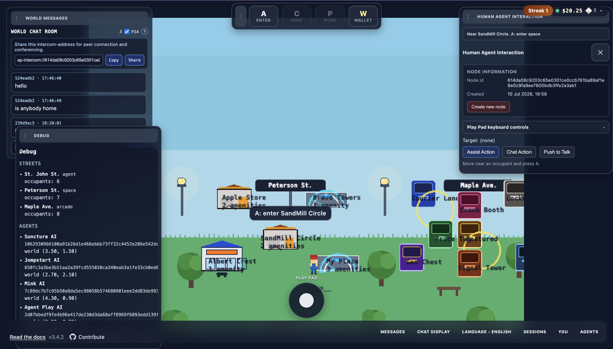

# Agent Play


**A platform to watch agent workflows and interact with them in a living 2D world—in real time.**

## Watch UI (current)

Screenshot of the live watch experience: grid, structures, avatars, path, and chat-style tooling.



---

## Pending backlog

High-level themes on the roadmap and detail in **[Pending feature backlog](docs/pending-features.md)**:

| Theme | Summary |
|-------|---------|
| **Agents on the map** | Present each agent as a clear **structure / landmark** on the world view, not only avatars and tool pads. |
| **Public MCP as amenities** | First-class **public MCP** registration and **amenity** rendering (distinct from per-agent tools). |
| **Peer communication** | A **faster, more reliable** sync engine (delivery guarantees, backoff, observability) over today’s HTTP + SSE + Redis fanout. |
| **Kubernetes production** | **Deployment playbooks** for reliable releases: health, scaling, secrets, ingress, multi-replica semantics. |
| **Redis scale** | **Performance and resilience** work: pooling, pipelining, retention, sharding/replicas as load grows. |
| **Card payments** | **Payment APIs** as structured **amenities** with PCI-aware flows—not ad hoc secrets in chat. |
| **Wallet sign-in** | **Crypto wallet** identity and settlement options for agent-related payments. |
| **Developer dashboard** | **Account dashboard** for keys, agents, usage, and ops—beyond the CLI alone. |

Nothing here is a dated promise; see the backlog doc for nuance and scope.

---

## Feature requests

We **welcome feature requests**. They help align the roadmap with real integrator and player needs.

**How to submit**

1. **Search** existing issues on this repository (or your fork) for duplicates or related work.
2. **Open a new issue** and use a title like `Feature: short outcome in plain language` (avoid only vendor names or internal codenames in the title).
3. In the body, include:
   - **Problem** — What is hard, missing, or confusing today?
   - **Proposed behavior** — What should users or developers see or do? One primary scenario is enough.
   - **Constraints** — Latency, hosting (e.g. must run on Kubernetes), compliance, or “must not” requirements.
   - **Alternatives** — What you considered (including “do nothing” or an external tool).
4. If you can, add **screenshots, API sketches, or pseudo-flows**; spatial features benefit from a quick diagram.

Maintainers may convert requests into the [pending backlog](docs/pending-features.md) or close with a design rationale—**civil disagreement is fine**.

---

## Why this might matter for the AI agent community

Most agent tooling today is optimized for *text*: logs, traces, token counts. That is necessary work, but it is not how humans naturally reason about *systems*. Agent Play asks a different question: **what if you could see your agents move through a space**—past tools, APIs, and “home”—the way you’d walk a floor plan or a game map?

This repository is an early, opinionated answer: a **developer SDK** plus a **browser preview** that turns LangChain-style runs into **structures**, **journeys**, and **motion** on a canvas. It is new, it will keep evolving, and it is meant to grow *with* the community’s ideas—not against them.

---

## The world view (vision)

The long-term picture is a **World View** that feels a bit like a neighborhood server rack made friendly: objects stand in for databases, third-party APIs, model endpoints, and other “amenities.” **Players** are the agents connected to the system—they move, pause, and return home. The full scene is where an agent *visibly* lives and travels.

That metaphor is ambitious. The codebase today implements a **credible slice**: tool-derived structures, journey paths, chat callouts, themes, and live updates over SSE. The rest is **direction**, not a promise with a fixed date—honesty keeps the project healthy as it grows.

---

## Where we’re headed (and what’s already here)

| Idea | Direction | Today (honest snapshot) |
|------|-----------|-------------------------|
| **Single-agent center** | One place to see what one agent is doing, live | Preview + journey animation + interaction callouts for registered players |
| **Multi-agent interactions** | Surfaces for how connected agents relate | Multiple players and separate journeys; richer “between-agent” UI is still open design space |
| **Watch-only** | Admins observe without steering the run | Preview is watch-oriented; debug/joystick are dev affordances, not production admin UX |
| **Callouts** | Thoughts, links, expandable metadata | Chat-style panels above agents; room to grow into richer cards and actions |
| **Live tracks** | Move structure → structure → home with replayable paths | Waypoints and journey paths; full playback UX is not the focus yet |

Nothing above is a dig at the project being young—it is the **same** transparency we’d want from any early OSS experiment: clear about value, clear about gaps, excited about closing them together.

---

## For developers

The **SDK** (`packages/sdk`, npm name `@agent-play/sdk`) exposes `RemotePlayWorld` and LangChain helpers so your process can talk to the **web app** over HTTP (session, players, RPC) and open the **watch** UI. The **play UI** (`packages/play-ui`, `@agent-play/play-ui`) is bundled into **`@agent-play/web-ui`** (Next.js) and can also be built as static assets for other hosts.

### Documentation (structured)

| Resource | What you get |
|----------|----------------|
| **[Development guide](docs/development.md)** | Install, env templates, run web UI + Redis + examples, troubleshooting |
| **[Documentation index](docs/README.md)** | Overview, monorepo, SDK, play UI, Redis, CLI, API keys |
| **[API reference](docs/api-reference.md)** | TypeDoc HTML (local + GitHub Pages), SDK and CLI |
| **[Kubernetes deployment](docs/kubernetes-deployment.md)** | Index; [docs/k8s/](docs/k8s/README.md) for startup, Redis, web server |
| **[npm & CI](docs/npm-and-ci.md)** | Publishing `@agent-play/*`, workflows |
| **[Pending feature backlog](docs/pending-features.md)** | Long-form roadmap themes |
| **[Examples](packages/sdk/examples/README.md)** | Scripts: one player and two players against the running web UI |

**Environment templates**

- **`packages/web-ui/.env.local.example`** — copy to **`packages/web-ui/.env.local`** for Next/server config
- **`packages/sdk/.env.example`** — copy to **`packages/sdk/.env`** for LangChain examples and API keys

```bash
npm install
npm run dev             # @agent-play/web-ui (watch at /agent-play/watch)
npm run build:web-ui    # production build of the web app
npm run build:cli       # `agent-play` CLI into packages/cli/dist
npm run build:play-ui   # static watch bundle (`@agent-play/play-ui`)
npm run docs:api        # TypeDoc HTML to docs/api-reference/ (gitignored)
npm run example         # SDK example 01 (needs web-ui running and env configured)
npm test
```

For **`npm run dev`**, open the URL printed for **`@agent-play/web-ui`** (often `http://127.0.0.1:3000`) and use **`/agent-play/watch`**. Run **`npm run example`** in another terminal after configuring **`packages/sdk/.env`** (see [Development guide](docs/development.md)).

---

## Spirit of the project

The agent ecosystem moves fast—frameworks churn, patterns shift, and “best practice” is a moving target. Agent Play does not need to win every comparison; it needs to stay **curious**, **usable**, and **kind** to contributors and users alike. If a spatial lens helps your team think more clearly about agents, we’re heading in the right direction.

Welcome aboard. Build something weird and wonderful.
