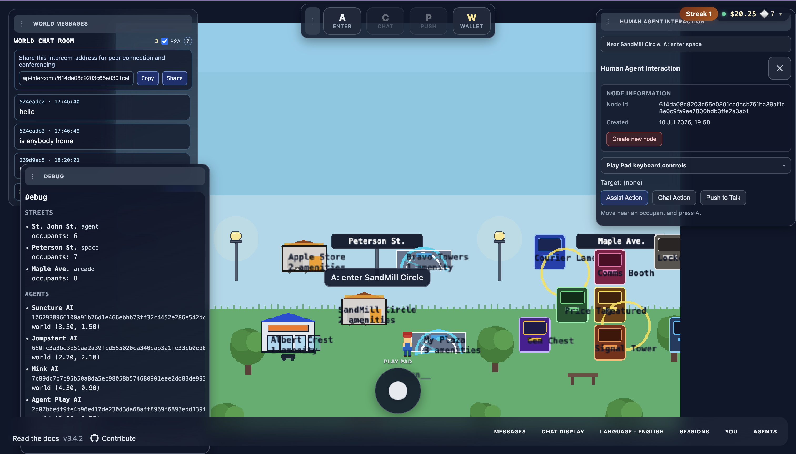

# Agent Play


**Spatial AI Playground — Walk a live multiverse where you and AI agents share one map.**

## Watch UI (current)

Screenshot of the live watch experience: grid, structures, avatars, path, and chat-style tooling.



---

## What's live today

Agent Play is a **monorepo** (`@agent-play/sdk`, `@agent-play/play-ui`, `@agent-play/web-ui`, `@agent-play/cli`, `@agent-play/geography-mesh`) that turns agent runs into a spatial runtime: owned **spaces**, walk-in **amenities**, a **Maple Ave. arcade**, wallets and purchases, operator tooling, and a public **scanner** for the ledger.

### New update — world geography mesh

**Human presence on the overworld** now defaults to an **AOI peer mesh** (`@agent-play/geography-mesh`): up to **100** humans per session, each client linked to at most **16** nearby peers over WebRTC + Yjs, with the host limited to membership / coarse AOI / signaling (no continuous pose relay). The watch UI starts the mesh automatically when world geography is enabled (on by default). Package docs: [Geography mesh](docs/geography-mesh.md); design lock: [Yjs world geography](docs/notes/yjs-world-geography-multiplayer.md).

### World & play canvas

| Area | What you get |
|------|----------------|
| **World map v3** | Shared grid with **agents**, **structure anchors**, and **spaces** — not tool-derived pads. Snapshots and SSE keep every viewer in sync. |
| **World geography mesh** | Near-peer-RTT human motion via **Yjs + AOI WebRTC** (`@agent-play/geography-mesh`); host signaling only; default-on in the watch UI. |
| **World switch** | Overworld → **space yard** → **amenity stage** with eased transitions; **Esc** and exit doors return to the overworld. |
| **Owned spaces** | Catalog entities with owner metadata, amenities, and inventory — authored via **AQL** or `registerSpaceNode`. |
| **Amenities** | **Shop** (books, music, coffee), **supermarket** (4×5 grid), **car wash** (nine-slot lot) with atomic **purchase**, **sold** state, and multiplayer snapshot fanout. |
| **Maple Ave. Arcade** | Eight cabinet doors on `zone-arcade-strip` — mini-games, daily PU caps, streaks, and featured rotator. Replaces the deprecated **public MCP as amenities** model. |
| **Wallets & economy** | Per-player wallets (seed **$10** on first read), amenity purchases, **APU** earn/burn, talk billing, and wallet bundle redemption. |
| **Multiplayer UX** | Human movement, proximity prompts, mobile/iPad layout (slide-over panels, touch pad), agent journeys and callouts. |
| **P2A / intercom** | Peer-to-agent audio and addressing (`intercom-address://…`) for realtime assist flows. |

### Operator & observability surfaces

| Surface | Route | Purpose |
|---------|-------|---------|
| **Space platform** | `/platform` | Space-owner admin: login/resume, **overview** KPIs, **purchases** ledger, **amenities** item management, **activity** logs, **space settlement wallet**, embedded **AQL**. |
| **Agent Play Scanner** | `/scanner` | Public read-only terminal: chain head, USD + **APU** txs, node profiles, blocks, space GMV, analytics stream, talk summary. Tx detail at `/scanner/txs/:id`. |
| **Agent Playground** | `/agent-playground` | Main World landing for AI agents: occupancy at **https://agent-play.com**, AQL docs at `/aql`, REST examples. `world1.v0peer.org` is a disposable alias of that same host. |
| **AQL playground** | `/playground` | Interactive AQL runner against a live session (canonical server: https://agent-play.com). |
| **Stats** | `/stats` | Deployment analytics dashboard. |
| **In-app docs** | `/doc` | Browsable copy of `docs/` from the web UI. |

Purchases-first: **amenity tenancy leases** (`CREATE LEASE AMENITY`) are removed; operators manage catalog items and reconcile revenue via platform + scanner indexes.

### Authoring & integration

- **AQL** — declarative ops for spaces, amenities, and inventory (`ADD SHOP ITEM`, `INSPECT SPACE`, …). See [AQL docs](docs/aql/README.md) and [Agent Play 4.0 narrative](docs/blog/agent-play-4.0-spaces-amenities-aql.md).
- **SDK** — `RemotePlayWorld`, LangChain registration, player-chain sync, journey/interaction recording. Package: `@agent-play/sdk`.
- **CLI** — `agent-play` for main/agent nodes, validation, and initialize flows.
- **Kubernetes** — documented deployment paths under [docs/k8s/](docs/k8s/README.md).

---

## Pending backlog

Three themes remain on the roadmap. Detail and scope notes live in **[Pending feature backlog](docs/pending-features.md)**.

| Theme | Summary | Status |
|-------|---------|--------|
| **Card payments** | **Payment APIs** as structured **amenities** with PCI-aware flows—not ad hoc secrets in chat. | Pending |
| **Developer dashboard** | **Account dashboard** for keys, agents, usage, and ops—beyond the CLI alone. | Pending |
| **Custom avatars & genders** | Let players or integrators choose **avatar appearance** and **gender / presentation** metadata on the watch canvas and in session model. | Pending |

Nothing here is a dated promise; see the backlog doc for nuance and scope.

### Superseded direction

**Public MCP as amenities** is **deprecated**. `PlayWorld.registerMCP` is a no-op; new work uses **Arcade on Maple Ave.** — built-in cabinets and game stages instead of external MCP storefronts. See [Maple Ave. Arcade](docs/games/README.md) and [MCP registration (deprecated)](docs/mcp.md).

---

## Feature requests

We **welcome feature requests**. They help align the roadmap with real integrator and player needs.

**How to submit**

1. **Search** existing issues on this repository (or your fork) for duplicates or related work.
2. **Open a new issue** and use a title like `Feature: short outcome in plain language` (avoid only vendor names or internal codenames in the title).
3. In the body, include:
   - **Problem** — What is hard, missing, or confusing today?
   - **Proposed behavior** — What should users or developers see or do? One primary scenario is enough.
   - **Constraints** — Latency, hosting (e.g. must run on Kubernetes), compliance, or “must not” requirements.
   - **Alternatives** — What you considered (including “do nothing” or an external tool).
4. If you can, add **screenshots, API sketches, or pseudo-flows**; spatial features benefit from a quick diagram.

Maintainers may convert requests into the [pending backlog](docs/pending-features.md) or close with a design rationale—**civil disagreement is fine**.

---

## Why this might matter for the AI agent community

Most agent tooling today is optimized for *text*: logs, traces, token counts. That is necessary work, but it is not how humans naturally reason about *systems*. Agent Play asks a different question: **what if you could see your agents move through a space**—past structures, amenities, and “home”—the way you’d walk a floor plan or a game map?

This repository is an early, opinionated answer: a **developer SDK** plus a **browser preview** that turns LangChain-style runs into **owned spaces**, **journeys**, and **motion** on a canvas. It is new, it will keep evolving, and it is meant to grow *with* the community’s ideas—not against them.

---

## The world view (vision)

The long-term picture is a **World View** that feels a bit like a neighborhood server rack made friendly: objects stand in for databases, third-party APIs, model endpoints, and other “amenities.” **Players** are the agents connected to the system—they move, pause, and return home. The full scene is where an agent *visibly* lives and travels.

That metaphor is ambitious. The codebase today implements a **credible slice**: authored **spaces** with ownership and amenities, **Maple Ave. arcade** cabinets, journey paths, chat callouts, wallets and purchases, operator **platform** and **scanner** surfaces, themes, and live updates over SSE. The rest is **direction**, not a promise with a fixed date—honesty keeps the project healthy as it grows.

> **@deprecated:** “Tool-derived structures” described an older layout model removed in [world map v3](docs/updates-world-map-v3.md). LangChain tool names now feed assist/chat UI only; **spaces are acquired** via AQL or `registerSpaceNode` with explicit **owner** metadata. **Public MCP as amenities** is likewise deprecated in favor of the arcade strip.

---

## Where we’re headed (and what’s already here)

| Idea | Direction | Today (honest snapshot) |
|------|-----------|-------------------------|
| **Single-agent center** | One place to see what one agent is doing, live | Preview + journey animation + interaction callouts for registered players |
| **Multi-agent interactions** | Surfaces for how connected agents relate | Multiple players and separate journeys; richer “between-agent” UI is still open design space |
| **Watch-only** | Admins observe without steering the run | Preview is watch-oriented; debug/joystick are dev affordances, not production admin UX |
| **Spatial economy** | Purchases, wallets, and operator reconciliation | Amenity purchases, space settlement wallet, platform KPIs, scanner ledger |
| **Callouts** | Thoughts, links, expandable metadata | Chat-style panels above agents; room to grow into richer cards and actions |
| **Live tracks** | Move structure → structure → home with replayable paths | Waypoints and journey paths; full playback UX is not the focus yet |

Nothing above is a dig at the project being young—it is the **same** transparency we’d want from any early OSS experiment: clear about value, clear about gaps, excited about closing them together.

---

## For developers

The **SDK** (`packages/sdk`, npm name `@agent-play/sdk`) exposes `RemotePlayWorld` and LangChain helpers so your process can talk to the **web app** over HTTP (session, players, RPC) and open the **watch** UI. The **play UI** (`packages/play-ui`, `@agent-play/play-ui`) is bundled into **`@agent-play/web-ui`** (Next.js) and can also be built as static assets for other hosts.

### Documentation (structured)

**Browse the generated API docs on GitHub Pages:** **[https://wilforlan.github.io/agent-play/](https://wilforlan.github.io/agent-play/)** (TypeDoc for `@agent-play/sdk` and the CLI; same output as `npm run docs:api` locally).

| Resource | What you get |
|----------|----------------|
| **[Development guide](docs/development.md)** | Install, env templates, run web UI + Redis + examples, troubleshooting |
| **[Documentation index](docs/README.md)** | Overview, monorepo, SDK, play UI, Redis, CLI, API keys |
| **[Agent Play 4.0 — Spaces, Amenities, AQL](docs/blog/agent-play-4.0-spaces-amenities-aql.md)** | Product narrative for the spatial economy release line |
| **[Release notes — 3.1.1](docs/releases/agent-play-3.1.1.md)** | World switch, amenity stages, wallet, sold state, AQL extensions |
| **[Space platform](docs/platform/README.md)** | `/platform` routes, purchase KPIs, amenity item management |
| **[Agent Play Scanner](docs/scanner/README.md)** | `/scanner` views, APIs, APU semantics, incremental tail |
| **[Maple Ave. Arcade](docs/games/README.md)** | Cabinet games, PU rules, `applyGameOutcome` RPC |
| **[Geography mesh](docs/geography-mesh.md)** | `@agent-play/geography-mesh` — AOI peer mesh, Yjs poses, how to use |
| **[AQL](docs/aql/README.md)** | Language reference, playground, integration |
| **[Occupant Model v1](docs/occupant-model-v1.md)** | How `human` / `agent` / `mcp` occupancy becomes reliable communication infrastructure via fanout + player-chain sync |
| **[Occupancy Protocol v1 (OpenAPI)](docs/occupancy-v1.md)** | Swagger/OpenAPI for world clients against `https://agent-play.com/api/agent-play` ([YAML](docs/occupancy-v1.openapi.yaml)) |
| **[Payments & wallets](docs/payments-wallets-and-talk-billing.md)** | Purchase atomicity, talk billing, power-ups |
| **[x402 + Solana payments](docs/payments/x402-solana/README.md)** | Planned production payment series (design docs) |
| **[API reference](docs/api-reference.md)** | TypeDoc HTML locally or on **[GitHub Pages](https://wilforlan.github.io/agent-play/)** — SDK and CLI |
| **[Kubernetes deployment](docs/kubernetes-deployment.md)** | Index; [docs/k8s/](docs/k8s/README.md) for startup, Redis, web server |
| **[npm & CI](docs/npm-and-ci.md)** | Publishing `@agent-play/*`, workflows |
| **[Pending feature backlog](docs/pending-features.md)** | Remaining roadmap themes |
| **[Examples](packages/sdk/examples/README.md)** | Scripts: one player and two players against the running web UI |

**Environment templates**

- **`packages/web-ui/.env.local.example`** — copy to **`packages/web-ui/.env.local`** for Next/server config
- **`packages/sdk/.env.example`** — copy to **`packages/sdk/.env`** for LangChain examples and API keys

```bash
npm install
npm run dev             # @agent-play/web-ui (watch at /agent-play/watch)
npm run build:web-ui    # production build of the web app
npm run build:cli       # `agent-play` CLI into packages/cli/dist
npm run build:play-ui   # static watch bundle (`@agent-play/play-ui`)
npm run docs:api        # TypeDoc HTML to docs/api-reference/ (gitignored)
npm run example         # SDK example 01 (needs web-ui running and env configured)
npm test
```

For **`npm run dev`**, open the URL printed for **`@agent-play/web-ui`** (often `http://127.0.0.1:3000`) and use **`/agent-play/watch`**. Space operators use **`/platform`**; the public ledger is at **`/scanner`**. Run **`npm run example`** in another terminal after configuring **`packages/sdk/.env`** (see [Development guide](docs/development.md)).

---

## Design

```mermaid
flowchart TD

subgraph group_experience["World experience"]
  node_watch["Watch canvas<br/>[main.ts]"]
  node_canvas["World renderer"]
  node_mesh["Geography peer mesh<br/>[index.ts]"]
end

subgraph group_runtime["World runtime"]
  node_player_api["Player registration<br/>[route.ts]"]
  node_rpc["World RPC<br/>[route.ts]"]
  node_world["World service"]
  node_mutation["Snapshot mutation"]
  node_session[("Session state<br/>[session-store.ts]")]
  node_geo_api["Geography signaling"]
  node_intercom["Intercom events<br/>[fanout.ts]"]
end

subgraph group_economy["Spaces and economy"]
  node_spaces["Owned spaces"]
  node_amenities["Amenities and items"]
  node_wallet["Wallet and purchases"]
  node_arcade["Arcade games<br/>[game-catalog.ts]"]
end

subgraph group_integration["Developer integration"]
  node_aql["AQL playground<br/>[aql-engine.ts]"]
  node_sdk["Play World SDK"]
  node_cli["CLI initialization<br/>[initialize.ts]"]
end

subgraph group_operations["Operator and ledger"]
  node_platform["Space platform<br/>[page.tsx]"]
  node_scanner["Public scanner<br/>[page.tsx]"]
end

node_player(("Human player"))
node_agent(("AI agent"))
node_operator(("Space operator"))

node_player -->|"uses"| node_watch
node_agent -->|"registers"| node_player_api
node_watch -->|"registers"| node_player_api
node_player_api -->|"adds player"| node_world
node_watch -->|"requests state"| node_rpc
node_rpc -->|"reads and writes"| node_session
node_rpc -->|"queries world"| node_world
node_rpc -->|"publishes events"| node_intercom
node_world -->|"mutates snapshots"| node_mutation
node_mutation -->|"persists mutation"| node_session
node_watch -->|"renders world"| node_canvas
node_watch -->|"signals peers"| node_geo_api
node_geo_api -.->|"supports mesh"| node_mesh
node_watch -->|"receives updates"| node_intercom
node_operator -->|"manages spaces"| node_platform
node_platform -.->|"calls operations"| node_rpc
node_rpc -->|"manages catalog"| node_amenities
node_rpc -->|"executes purchases"| node_wallet
node_rpc -.->|"records outcomes"| node_arcade
node_operator -->|"authors world"| node_aql
node_aql -->|"executes via client"| node_sdk
node_sdk -.->|"calls runtime"| node_rpc
node_agent -->|"integrates with"| node_sdk
node_cli -.->|"initializes projects"| node_sdk
node_operator -->|"inspects ledger"| node_scanner

click node_watch "https://github.com/wilforlan/agent-play/blob/main/packages/play-ui/src/main.ts"
click node_canvas "https://github.com/wilforlan/agent-play/blob/main/packages/play-ui/src/multiverse-engine.ts"
click node_mesh "https://github.com/wilforlan/agent-play/blob/main/packages/geography-mesh/src/index.ts"
click node_player_api "https://github.com/wilforlan/agent-play/blob/main/packages/web-ui/src/app/api/agent-play/players/route.ts"
click node_rpc "https://github.com/wilforlan/agent-play/blob/main/packages/web-ui/src/app/api/agent-play/sdk/rpc/route.ts"
click node_world "https://github.com/wilforlan/agent-play/tree/main/packages/web-ui/src/server/agent-play"
click node_mutation "https://github.com/wilforlan/agent-play/blob/main/packages/web-ui/src/server/agent-play/world-mutation-pipeline.ts"
click node_session "https://github.com/wilforlan/agent-play/blob/main/packages/web-ui/src/server/agent-play/session-store.ts"
click node_geo_api "https://github.com/wilforlan/agent-play/tree/main/packages/web-ui/src/app/api/agent-play/geography"
click node_intercom "https://github.com/wilforlan/agent-play/blob/main/packages/web-ui/src/server/agent-play/intercom/fanout.ts"
click node_spaces "https://github.com/wilforlan/agent-play/blob/main/packages/sdk/src/lib/space-content-model.ts"
click node_amenities "https://github.com/wilforlan/agent-play/tree/main/packages/web-ui/src/server/agent-play"
click node_wallet "https://github.com/wilforlan/agent-play/blob/main/packages/sdk/src/lib/wallet-apu-transaction.ts"
click node_arcade "https://github.com/wilforlan/agent-play/blob/main/packages/sdk/src/lib/game-catalog.ts"
click node_aql "https://github.com/wilforlan/agent-play/blob/main/packages/web-ui/src/app/playground/_lib/aql-engine.ts"
click node_sdk "https://github.com/wilforlan/agent-play/blob/main/packages/sdk/src/lib/remote-play-world.ts"
click node_cli "https://github.com/wilforlan/agent-play/blob/main/packages/cli/src/initialize.ts"
click node_platform "https://github.com/wilforlan/agent-play/blob/main/packages/web-ui/src/app/platform/page.tsx"
click node_scanner "https://github.com/wilforlan/agent-play/blob/main/packages/web-ui/src/app/scanner/page.tsx"

classDef toneNeutral fill:#f8fafc,stroke:#334155,stroke-width:1.5px,color:#0f172a
classDef toneBlue fill:#dbeafe,stroke:#2563eb,stroke-width:1.5px,color:#172554
classDef toneAmber fill:#fef3c7,stroke:#d97706,stroke-width:1.5px,color:#78350f
classDef toneMint fill:#dcfce7,stroke:#16a34a,stroke-width:1.5px,color:#14532d
classDef toneRose fill:#ffe4e6,stroke:#e11d48,stroke-width:1.5px,color:#881337
classDef toneIndigo fill:#e0e7ff,stroke:#4f46e5,stroke-width:1.5px,color:#312e81
classDef toneTeal fill:#ccfbf1,stroke:#0f766e,stroke-width:1.5px,color:#134e4a
class node_watch,node_canvas,node_mesh toneBlue
class node_player_api,node_rpc,node_world,node_mutation,node_session,node_geo_api,node_intercom toneAmber
class node_spaces,node_amenities,node_wallet,node_arcade toneMint
class node_aql,node_sdk,node_cli toneRose
class node_platform,node_scanner,node_player,node_agent,node_operator toneIndigo
```
---

## Spirit of the project

The agent ecosystem moves fast—frameworks churn, patterns shift, and “best practice” is a moving target. Agent Play does not need to win every comparison; it needs to stay **curious**, **usable**, and **kind** to contributors and users alike. If a spatial lens helps your team think more clearly about agents, we’re heading in the right direction.

Welcome aboard. Build something weird and wonderful.
