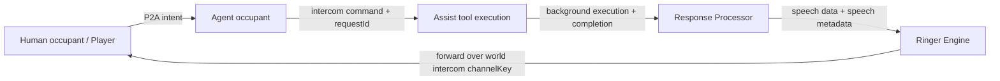

# Agent Play P2A implementation architecture

## Purpose

This document defines the target architecture for **P2A (Peer to Agent communication)** in Agent Play, where human occupants and agent occupants can exchange audio messages through **Ringer Engine** play rooms using intercom-compatible routing and channel keys.

The goal is to add voice communication without breaking existing world/intercom contracts.

Assist tools are the core world background runtime for this architecture. For the focused runtime definition, see [Assist tools as world background runtime](assist-tools-world-background-runtime.md).
For the intercom addressing model that powers Agent Ringer and frontend `/` delivery, see [Intercom-address architecture](intercom-address.md).

**See also:** [P2A realtime hub](p2a/index.md) documents the **OpenAI Realtime** path using SDK-managed client secrets (`initAudio()`, `addAgent({ enableP2a })`), complementary to the Ringer-centric flow below.

## Scope

This plan covers:

- **Assist tools** as the core world background execution component for agent work.
- A **response processor** that produces speech payloads and metadata.
- **Ringer Engine** play rooms as the only media runtime (LiveKit is out of scope).
- Intercom-compatible forwarding and channel-key correlation.
- Watch/canvas UX changes (toggle + help entry point).
- Client-side audio playback behavior based on user presence.

This plan does not define:

- A final codec/transport at packet level.
- Billing, quotas, or moderation policy internals.
- Mobile-specific audio capture implementation details.

## Terminology

- **P2A**: Peer to Agent communication between human occupants and agent occupants.
- **Play room**: Audio routing context in Ringer Engine where a node can send/receive speech.
- **Intercom-address**: A shareable addressing value derived from `channelKey` for routing, UI display, and room join flows.
- **Assist tool**: The primary capability unit used for world background execution. Assist tools can complete quickly or run as long-running background operations.
- **Response processor**: Post-assist stage that converts logical response content into speech-ready payloads and metadata.

## Architecture overview



## Core design principles

- Reuse **existing intercom channelKey architecture** for addressing and correlation.
- Treat assist execution as **asynchronous and durable** when needed, not UI-blocking.
- Keep world state as source of truth for visibility/interaction while media payloads flow through ringer paths.
- Preserve request correlation end to end with `requestId`.
- Keep P2A optional and user-controlled at the UI layer.
- Keep implementation primarily in web client and ringer layers; avoid SDK API expansion for this feature.

## Component responsibilities

### 1) P2A request intake

Input sources:

- Canvas proximity interactions.
- Interaction panel actions.
- Future API hooks for direct node/occupant audio messages.

Responsibilities:

- Resolve `fromPlayerId`, `toPlayerId`, and `channelKey`.
- Construct `intercom-address` directly from `channelKey`.
- Allocate or reuse a request-scoped `requestId`.
- Emit command envelope for downstream assist execution.
- When P2A mode is enabled, route client-to-agent responses through the play room response parser so delivery is audio-first.

### 2) Assist tools (core world background component)

Responsibilities:

- Treat assist tools as the default engine for world background execution.
- Allow assist tools to run as background operations when execution is long-running.
- Keep assist definitions mapped by:
  - tool name,
  - input schema,
  - execution function,
  - optional progress/event hooks,
  - completion formatter contract.
- Accept command envelopes and dispatch to mapped assist tool execution.
- Emit lifecycle events (`queued`, `running`, `progress`, `completed`, `failed`, `timeout`, `cancelled`) for assist operations.
- Return final result payload plus user-facing message content for response processing.

Expected contract shape (conceptual):

```ts
type AssistExecutionContext = {
  requestId: string;
  fromPlayerId: string;
  toPlayerId: string;
  channelKey: string;
  startedAtIso: string;
};

type AssistToolDefinition = {
  toolName: string;
  execute: (input: unknown, context: AssistExecutionContext) => Promise<{
    message: string;
    result: Record<string, unknown> | null;
  }>;
};
```

### 3) Response processor (speech adaptation layer)

Responsibilities:

- Receive completed assist output and final user message intent.
- Build canonical playback text with required format:
  - `Hello, you have an incoming message from {target name}. They have the following message: {message from target}`
- Generate speech payload and metadata for ringer playback.
- Attach correlation metadata: `requestId`, `channelKey`, `fromPlayerId`, `toPlayerId`, timestamps.
- Produce consistent terminal response records for UI/state diagnostics.

Output contract (conceptual):

```ts
type RingerSpeechEnvelope = {
  requestId: string;
  channelKey: string;
  fromPlayerId: string;
  toPlayerId: string;
  playbackText: string;
  speech: {
    encoding: "pcm" | "wav" | "mp3" | "opus";
    sampleRateHz: number;
    dataBase64: string;
    durationMs?: number;
  };
  metadata: {
    source: "p2a";
    toolName?: string;
    generatedAtIso: string;
  };
};
```

### 4) Ringer Engine (media routing and room orchestration)

Responsibilities:

- Implement play rooms that receive speech requests from any node/occupant.
- Route playback back to the same node/occupant through forwarders aligned to intercom `channelKey`.
- Maintain room membership/subscription semantics for users who enable P2A audio.
- Emit delivery state (`accepted`, `sent`, `played`, `failed`) for observability.

Out of scope:

- LiveKit integration (explicitly excluded in this plan).

### 5) World intercom forwarder

Responsibilities:

- Ensure speech envelopes are forwarded over existing intercom-compatible addressing.
- Preserve channel identity with the current `channelKey` structure and derived `intercom-address`.
- Prevent cross-channel leakage by strict `requestId + channelKey` matching.
- Support `intercom-address` resolution so shared addresses can join the same conferencing room path.

`intercom-address` construction (conceptual):

```ts
type IntercomAddress = {
  channelKey: string;
  address: string;
};

const buildIntercomAddress = (options: {
  channelKey: string;
}): IntercomAddress => {
  const { channelKey } = options;
  return {
    channelKey,
    address: `intercom-address://${channelKey}`,
  };
};
```

## Data and control flow

### End-to-end sequence

1. Human initiates P2A interaction targeting agent occupant.
2. System resolves or creates intercom `channelKey` and `requestId`.
3. Assist execution receives command and dispatches mapped assist tool.
4. Assist lifecycle events are emitted while execution progresses.
5. On completion, assist execution returns:
   - final user-intended message,
   - optional structured assist result.
6. Response processor formats canonical playback text and generates speech envelope.
7. Ringer Engine ingests envelope and forwards playback to recipient via channelKey-bound forwarder.
8. Delivery status is emitted for UI diagnostics and audit.

### Failure paths

- **Assist execution failure**: response processor emits fallback speech-safe error message and failed terminal event.
- **Speech generation failure**: emit text-only terminal response with failure metadata.
- **Forwarding failure**: keep retry policy bounded; emit failed delivery state and request correlation data.

## UX requirements

## Watch/canvas controls

Add a toggle near the world chat room count control:

- Label/tooltip: `enable P2A audio communication`
- Behavior:
  - Off: standard non-P2A response behavior applies.
  - On: responses are handled through P2A flow and user subscribes to relevant play room audio events.
  - Intended effect: the toggle helps ensure responses are processed and delivered in P2A mode.
  - When enabled, show the active `intercom-address` in the UI.
  - Provide copy/share controls so the `intercom-address` can be shared with other users for peer-to-peer conferencing room connection.

Add a help button (`?`) adjacent to the toggle:

- Link target: `/agent-play-p2a-implementation`
- Purpose: explain P2A meaning and system behavior.

`intercom-address` UI behavior:

- Visible only when P2A is enabled.
- Render as read-only value with copy action.
- Include short helper text indicating it can be shared for conferencing room join.
- Show join state when current user is connected through the displayed address.

## Playback content requirement

Client-side playback must use text received from the play room response parser and render audio through Ringer Engine.

Presence-aware playback policy:

- If user is present on page:
  - Play direct response only: `{message from target}`.
- If user is not present on page:
  - Play a ring tone for approximately 6 seconds.
  - Then play:
    - `Hello, you have an incoming message from {target name}. They have the following message: {message from target}`.

This policy is the required baseline for rollout.

## API and event planning

### Existing event flow (no new domain events)

Use existing Agent Play/intercom events for this phase.

- Use existing intercom response flow (for example `world:intercom` terminal response states) as the trigger source.
- Use existing interaction events where needed for transcript/diagnostic visibility.
- Do not introduce `world:p2a_*` events in this rollout.

Playback sequencing requirement:

- Speech playback starts only after the response is received from the existing event flow.
- If response is streaming, client playback begins only when the message is in the client-ready terminal state chosen for playback.

### Correlation fields (required)

Every event and payload in the chain should include:

- `requestId`
- `channelKey`
- `intercomAddress`
- `fromPlayerId`
- `toPlayerId`
- `ts` (ISO timestamp)

## SDK impact decision

For this iteration, the SDK should not implement new P2A APIs or behavior changes.

Implementation boundary:

- Keep P2A behavior in client-side integration and ringer runtime layers.
- Continue using existing intercom/channel-key architecture and existing SDK contracts.
- Avoid `@agent-play/sdk` public surface changes for P2A in this phase.

Rationale:

- Reduces rollout risk and compatibility impact.
- Keeps P2A optional and UI-controlled.
- Allows iterative evolution of assist/background behavior before committing new SDK APIs.

## Security and policy alignment

- Maintain Occupant Model policy constraints for initiators/targets where applicable.
- Keep audio forwarding scoped by channelKey to avoid unintended recipients.
- Scope shared `intercom-address` usage with channel access validation and expiration checks.
- Validate assist tool input schemas before execution.
- Avoid exposing raw assist execution internals in end-user speech text unless explicitly allowed.

## Operational requirements

- Assist execution should support retries where safe and idempotent.
- Define explicit timeout budgets per assist tool.
- Persist assist status transitions for debugging and recovery.
- Add metrics:
  - queue time,
  - execution time,
  - speech generation time,
  - delivery success rate.

## Rollout plan (phased)

### Phase 1: contracts and docs

- Finalize assist-background contract and response processor envelope.
- Land P2A docs and UI copy requirements.

### Phase 2: backend/runtime skeleton

- Implement assist execution lifecycle state transitions for background-capable tools.
- Wire response processor with placeholder speech generation.
- Wire ringer forwarder with channelKey correlation.

### Phase 3: UI integration

- Add canvas toggle + tooltip.
- Add adjacent help (`?`) link to `/agent-play-p2a-implementation`.
- Add playback status indicators in session interaction surfaces.

### Phase 4: hardening

- Add retries/timeouts/cancellation semantics.
- Add integration tests for request correlation and cross-channel isolation.
- Validate observability and operator runbooks.

## Testing strategy (future implementation)

Behavior-focused coverage should include:

- assist lifecycle transitions (`queued -> running -> completed/failed`);
- response processor format conformance to required speech template;
- strict `requestId + channelKey` propagation across all events;
- correct play room subscription behavior when toggle is on/off;
- delivery path from completed assist execution to audible playback envelope;
- no delivery to occupants outside the intended channel.

## Open decisions

- Final speech encoding default and max payload size.
- Whether to stream partial speech for long messages or only terminal playback.
- Whether room subscription is per session, per device, or per occupant identity.
- How to expose assist cancellation UX for humans when long-running operations occur.

## Summary

P2A extends Agent Play from text-first intercom into channel-keyed audio communication by introducing:

- assist tools as the core world background component,
- a response processor that produces speech payloads,
- a ringer-native play room runtime for delivery,
- and explicit user controls in the watch canvas.

The design keeps compatibility with existing world/intercom identity and correlation rules while creating a clear path for voice-first interaction flows.
