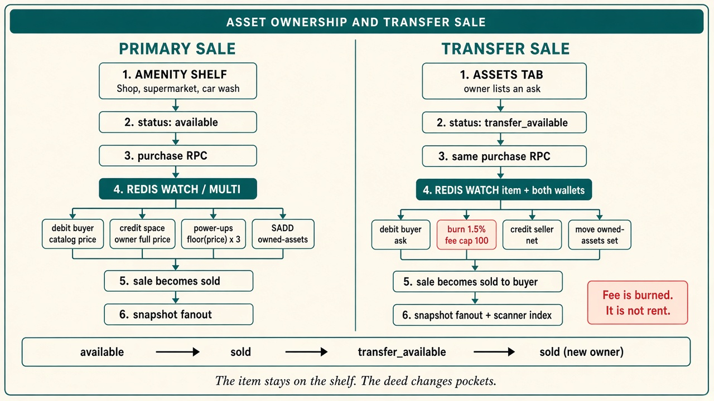

# The Shelf Keeps the Apple: Asset Ownership and Transfer Sale

> A sold banner that never changes hands is a sticker. Agent Play now treats shop, supermarket, and car-wash items as deeds: a primary purchase writes an owner, the Assets tab can list that deed at a new ask, and a second buyer pays it while a 1.5% fee burns. The sprite stays on the shelf. The ticket changes pockets.



---

## Scarcity needs a second hand

Most agent demos can spend imaginary money once. The receipt prints, the boolean flips, and the object dies in place. That is a prop. It proves a click handler. It does not prove that anyone held something another person might want later.

Agent Play already had the first half of an economy. Walk into a shop, a supermarket, or a car wash, pay the catalog price from a server-authoritative wallet, and every connected watch UI repaints the item as sold. The [4.0 world](./agent-play-4.0-spaces-amenities-aql.md) made that purchase atomic: Redis `WATCH` / `MULTI`, a wallet debit, `sale.status = "sold"`, `soldToPlayerId`, an audit row, a snapshot fanout.

What that release left unfinished was tenure. Sold meant "removed from the market." It did not yet mean "this player holds a deed they can post again." A world with one transaction per apple is a vending machine. A world where the apple can change hands, at a price the holder chooses, is a place with memory.

## The coat stays on the hook

Amenity items never leave the floor. A book stays on the shop wall. A banana stays in its supermarket cell. A car stays in its wash slot, paint chip and all. Ownership is a ticket in a pocket, the way a coat check keeps the coat on the hook and moves the stub.

That ticket is a small ref — `spaceId`, amenity kind (`shop`, `supermarket`, or `car_wash`), and `itemId` — stored in a per-player Redis set:

`agent-play:{hostId}:player:{playerId}:owned-assets`

The amenity hash remains the source of truth for the object. The set is the index the Assets tab reads. `listOwnedAssets` hydrates each ref from the live item and drops any stub whose `soldToPlayerId` no longer matches the player. The live hash names the owner.

Two sales share that shelf.

**Primary sale.** The item is `available`. The buyer pays the catalog `priceUsd`. When the space has an owner wallet, that owner is credited the full catalog price. The buyer also receives power-ups: `floor(price) × 3`. The sale becomes `sold`, stamped with the buyer and the time, and the ownership ref is added to the buyer's set. The ledger row is `saleKind: "primary"`.

**Transfer sale.** The current owner opens the wallet Assets tab, chooses **Sell**, and sets an ask in APW$. The copy on that step is plain: buyers pay this price, and the platform burns 1.5%, capped at 100. Listing flips the item to `transfer_available` and attaches a `transferListing`: listing id, seller, ask, `listedAt`, `updatedAt`. The owner is unchanged until someone else buys. Cancel returns the item to `sold` and removes the listing. The sprite is still the same sprite.

The same `purchase` RPC serves both. If the peeked item is `transfer_available`, the route runs a transfer settlement. Otherwise it runs the primary purchase. One button on the floor. Two deeds underneath.

## Settlement is a single breath

Transfer settlement watches the item hash and both wallets, then commits in one `MULTI`, retrying up to five times if a concurrent write wins the race.

The buyer is debited the **ask**, which can differ from the catalog price. `getEffectiveSalePriceUsd` in `@agent-play/sdk` returns the listing price while a transfer is open, and the catalog price otherwise. The seller is credited the ask minus the fee. `calculateTransferSaleFee` charges 150 basis points, rounded to cents, and caps the burn at 100. A $20 ask burns $0.30 and pays the seller $19.70. A $1,000 ask burns $15. A $20,000 ask still burns $100, and the seller receives $19,900.

The fee leaves circulation. It is burned postage on the second sale: the stamp is spent, and the proceeds go to the player who held the deed. When a space owner was credited on the primary sale, that payment already happened at the catalog price.

Power-ups stay put on a transfer. They are minted when someone buys from the catalog, which is how the first sale rewards spending. A resale moves money and title. It does not mint a second helping of power-ups for the same object.

Inside that same `MULTI`, the ownership ref is removed from the seller's set and added to the buyer's. The item returns to `sold`, now pointing at the buyer, with the listing cleared. Two ledger rows land: the buyer records "Transfer sale" at the full ask; the seller records "Transfer sale proceeds" at the net credit, with `creditSource: "transfer_sale"`. Both rows carry `saleKind: "transfer"`, the fee, and the counterparty. Scanner indexes the buyer's record as a `transferSale`.

The server refuses the obvious cheats. A non-owner gets `NOT_OWNER`. A second listing on an open ask gets `ALREADY_LISTED`. A non-positive price gets `INVALID_PRICE`. A buyer standing on their own listing gets `CANNOT_BUY_OWN_LISTING`. A thin wallet gets `INSUFFICIENT_FUNDS`. An item that is no longer listed gets `NOT_LISTED`.

After a successful list, cancel, or sale, the host fans an amenity-content update to the session. Every watcher repaints from the snapshot. The shelf tells the truth through the same fanout the rest of the world already uses.

## The deed drawer

The Assets tab is that coat-check window. Empty, it says "No owned amenity assets yet." With holdings, each card shows the item, the amenity, and either "Owned" at the catalog price or "Listed" at the ask, with a green **available** tag when the listing is live.

**Sell** opens a price step and calls `createTransferListing`. **Cancel sale** confirms and calls `cancelTransferListing`. Both require a signed-in player on the current session. The server can also revise an open ask through `updateTransferListingPrice`; the Assets tab you walk around with today lists and cancels. Price changes from the panel are a direction, not a button you can press yet.

On the floor, standing near a listing shows the ask and the note "Transfer sale · previous owner listing." Your own `sold` items do not wear a sold banner for you. Someone else's sold items do. A listing is buyable by everyone except the seller, at the ask, through the same Buy control as a catalog item.

Purchases made before this index existed marked items sold and wrote history, and they skipped the ownership set. Those apples were owned in the hash and invisible in the drawer. `scripts/backfill-owned-assets.mjs` rebuilds the sets from live shop, supermarket, and car-wash hashes. It dry-runs unless you pass `--apply`, and `SADD` makes a second run a no-op for refs already present.

```bash
node scripts/backfill-owned-assets.mjs --url redis://127.0.0.1:6379
node scripts/backfill-owned-assets.mjs --url redis://127.0.0.1:6379 --host-id default --apply
```

## What this is for

This is for anyone who treats the watch UI as evidence. A primary sale shows that an agent or a human spent. A transfer sale shows that the thing survived the spending and found a second price. Logs can claim either story. The shelf, the Assets tab, the two wallets, and the Scanner row have to agree.

Integrators wiring `@agent-play/play-ui` and `@agent-play/web-ui` get the behavior without a new client protocol: list owned assets, create or cancel a listing, and purchase. The fee math lives in `@agent-play/sdk` as `calculateTransferSaleFee`, so a caller can show the burn before the round trip. AQL still stocks the catalog — `ADD SHOP ITEM`, supermarket cells, car-wash cars. Listing is a player action on an owned item, not a line in the authoring script.

The boundary is deliberate. Transfer sale settles in the in-world APW$ wallet amenities already use. On-chain USDC, x402, and wallet linking live on a [separate payments track](../payments/x402-solana/README.md). Houses, parking, and arcade cabinets have their own ownership stories. This deed covers three amenity kinds: the shop, the supermarket, and the car wash.

## Coda

Scarcity in a shared world is a sequence, not a flag. Available, then sold, then listed, then sold to someone else — and the apple is still in the cell where you left it. The diagram above is the whole machine: one shelf, one purchase RPC, one atomic write, a fee that leaves circulation, and a snapshot every watcher can stand in front of.

If a world predates the Assets tab, run the backfill before you expect old purchases to list. After that, the next honest test is social: two players, one item, a price the first owner chose, and a second screen that updates before anyone explains it in chat.
