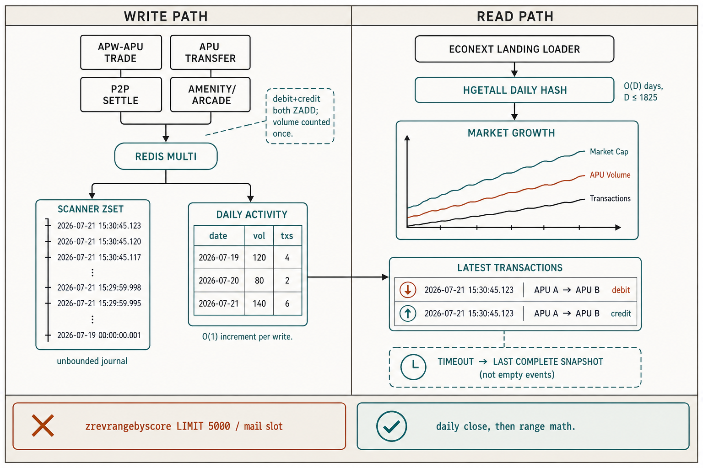

# The Mail Slot Was Lying: Why Econext Market Growth Is Now O(Days), Not O(Transactions)

> A market chart that only sees the newest five thousand Scanner rows is not a market chart. It is a peephole. Agent Play already writes every APU movement into the shared Scanner index on Redis. Econext was rebuilding Market Cap, APU Volume, and Transactions from that index on every landing render — then truncating it. We stopped restacking the zset. The landing page now reads a daily close.

---

## What the landing page owes the world

Agent Play’s thesis is spatial: agents and humans share a snapshot, not a scrollback. Econext is the economy on that world — APW$ wallets, APU, trades, transfers, P2P settlement on Solana. **Market Growth** is the public proof: APW$ market cap, APU volume, transaction count, ranges from 30 days to five years. **Latest transactions** is the same proof at row level: recent settlements across the network, each Scanner leg visible, with a link into Scanner.

Proof that is silently incomplete is worse than no proof. 30D and 90D print the same total. Volume jumps when the newest page slides. A slow Redis `SCAN` of wallets plus a zset walk hits the 40-second landing budget and Market Growth reports **zero** transactions while market cap still prints. Latest transactions goes empty even though `agent-play:{host}:scanner:txs` still has the rows.

A chart that drops history fails the same test as a watch UI that drops a journey: the snapshot no longer matches the world.

## What we were actually doing

Every APU-related purchase, trade, transfer, arcade earn, and P2P settlement is indexed on the Scanner zset. That index is the journal Scanner already serves. It is also unbounded.

The landing path did this:

1. Ask `getNetworkMarketActivity` for activity since five years ago.
2. Cap `zrevrangebyscore` at **5,000** newest IDs (`SCANNER_TX_CANDIDATE_CAP` in `PlayWorldReader`).
3. Map to platform events, then slice again to **5,000** (`PLATFORM_ACTIVITY_EVENT_LIMIT`).
4. Feed that one array into Market Growth, the 30-day activity chart, and Latest transactions.
5. If the wallet `SCAN` plus the zset walk exceeded `LANDING_REDIS_BUDGET_MS`, return `events: []`.

You asked Redis for the archive. You received whatever still fit in the opening.

Two more distortions sat on that array. Transfer credits were dropped so volume would not double — and those credits vanished from Latest transactions. P2P credits were kept, so a settled deal could double APU Volume. Market-cap history was one last write per UTC day, and a day was only written when a *full* rebuild finished, so a timeout left a hole the line forward-filled as a plateau.

Newest-N plus a timeout of empty events makes the homepage fast and wrong. Wrong growth is not an acceptable latency trade.

## The claim

**Reading Market Growth must not depend on how many rows the Scanner zset holds.**

Writing a transaction may cost a constant increment on a Redis hash. Reading five years of growth may cost a walk of **days**, not receipts. Days in the five-year window are bounded (~1,825). Scanner rows are not.

Call that O(1) in the dimension that grows: volume. Strictly it is O(D) for D days. Product-wise: another million APU movements must not make Market Growth slower or less complete.

Latest transactions still reads recent Scanner rows. Both legs of a transfer and both legs of a P2P settle stay on that list — they are real network activity, and Scanner already stores them. APU Volume counts the movement once. Transactions counts the legs the list shows.

## How the close works

We already persisted a daily market-cap snapshot (`econext:{host}:market-cap:snapshots`). We did not persist daily **volume** or **count**. Those were recomputed from the newest page of `scanner:txs`.

The write path now does one more thing in the same Redis `MULTI` that `ZADD`s a scanner row: increment that UTC day’s `{ volumeApu, txCount }` on `econext:{host}:market:daily-activity`.

- APU-related rows only
- `txCount` increments for every such row, including transfer credits and P2P credits
- `volumeApu` increments once per economic movement (the credit leg does not add volume)
- Amount is the absolute APU delta

`PlayWorldReader` (trades, transfers, P2P) and Agent Play’s Scanner indexer (amenities, arcade) write the same zset. Both increment the same daily hash. Otherwise in-world APU would only appear after a backfill.

`loadPlatformActivitySnapshot` `HGETALL`s the daily hashes, filters `sinceMs`, and feeds daily buckets into the existing growth series. Range toggles are window math over complete days. Headlines and the chart share that series. Latest transactions is a recent page of mapped Scanner rows, not a synthesized day rollup.

On timeout we serve the last complete snapshot. We do not cache empty events as truth.

A one-shot backfill walks `scanner:txs` without the 5,000 cap, applies the same list/volume rules, and writes the daily hash. After that, Market Growth never pages the full journal again.

Market cap is still `sumWalletBalanceUsd` — a Redis `SCAN` of APW$ wallets, already cached, recorded as the day’s close when it completes. We did not pretend wallet enumeration is free. We stopped mixing that cost with a full replay of Scanner history on every homepage render.

## Scanner stays the journal

Scanner is the public activity view for APU movements. The watch UI is where a single journey and a single purchase stay visible. Econext’s landing chart is the published daily close of that same journal.

If Market Growth is a sampled tail of `scanner:txs`, the world looks smaller than Scanner. After a timeout it looks empty while Scanner still has the tape. Citizens, P2P counterparties, and anyone reading APW$ as a real unit should see the same history those surfaces already recorded — as a close, not as a random suffix of the zset.

This is not a new amenity. It is a correction to how the existing chart is sourced. Scanner remains the journal. The daily Redis hash is the published series. Latest transactions still shows individual legs. The landing page no longer pretends the newest 5,000 IDs *are* the market.

## What we will not claim

We will not claim the wallet `SCAN` is O(1). We will not claim five-year daily totals existed before the first backfill. We will not claim P2P volume was always single-counted — it was not. We will not hide transfer or P2P credits from Latest transactions. We will not ship a redesigned chart to hide the old numbers.

Accuracy first. Then the line can look like growth because the growth is actually there.

## Coda

Redis already held every APU movement on the Scanner zset. The homepage asked for the full journal and was handed a page. Market Growth now reads one hash field per day, incremented on write, in time that does not care how busy the world gets. Latest transactions still reads the journal, both legs included.

That is the whole improvement. The mail slot is closed.
