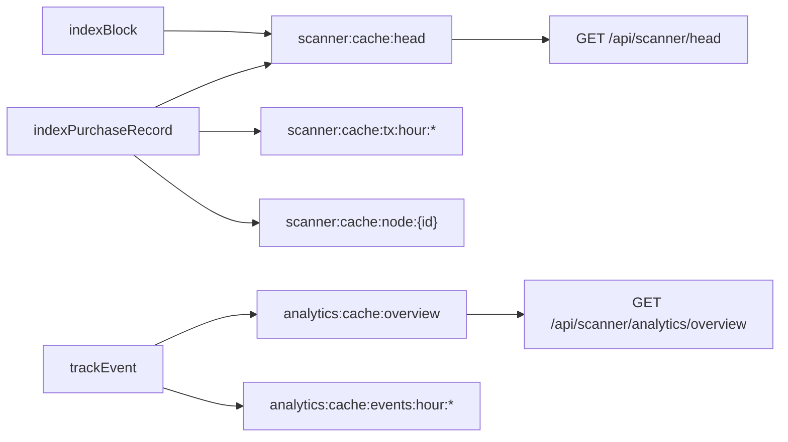

# Agent Play Scanner architecture

Runbook for the Scanner indexer, Redis keys, and write-through hooks.

## Separation of concerns

| Layer | Redis prefix | Purpose |
|-------|--------------|---------|
| Scanner ledger | `agent-play:{hostId}:scanner:*` | Global tx index, blocks, wallet cache |
| Analytics | `agent-play:{hostId}:analytics:*` | Segment-style events + properties |

Scanner never uses analytics keys for economic truth.

## Scanner Redis keys

```
agent-play:{hostId}:scanner:txs
agent-play:{hostId}:scanner:tx:{id}
agent-play:{hostId}:scanner:tx:by-player:{playerId}
agent-play:{hostId}:scanner:blocks
agent-play:{hostId}:scanner:wallets
agent-play:{hostId}:scanner:wallet:{playerId}
agent-play:{hostId}:scanner:migration:state
agent-play:{hostId}:scanner:cache:head
agent-play:{hostId}:scanner:cache:tx:hour:{yyyy-MM-dd-HH}
agent-play:{hostId}:scanner:cache:apu:mint:hour:{yyyy-MM-dd-HH}
agent-play:{hostId}:scanner:cache:apu:burn:hour:{yyyy-MM-dd-HH}
agent-play:{hostId}:scanner:cache:node:{nodeId}
```

Analytics materialized overview:

```
agent-play:{hostId}:analytics:cache:overview
agent-play:{hostId}:analytics:cache:events:hour:{yyyy-MM-dd-HH}
```

## Cache bump diagram



Hourly buckets roll up the last 24h without scanning every tx or `XRANGE` on each request. `readScannerHeadCache` / `readAnalyticsOverviewCache` sum 24 bucket keys. Legacy full-scan fallback remains when cache hash is empty (first deploy).

## Write-through hooks

Implemented in [`redis-session-store.ts`](../../packages/web-ui/src/server/agent-play/redis-session-store.ts) via [`scanner-hooks.ts`](../../packages/web-ui/src/server/scanner/scanner-hooks.ts):

1. `appendPurchaseRecord` → global tx index + analytics event
2. `executePurchase` / `redeemWalletBundle` → tx index + wallet cache (purchase path writes directly to Redis)
3. `applyGameOutcome` → APU tx via `appendPurchaseRecord` + wallet cache
4. `getPlayerWallet` (first seed) → wallet cache + `Wallet Seeded` analytics event
5. `persistSnapshotReturningRev` → block index + `Chain Revision Published` analytics event

Indexer failures are logged and swallowed; user-facing RPCs must not fail because indexing failed.

## Backfill

[`scanner-backfill.ts`](../../packages/web-ui/src/server/scanner/scanner-backfill.ts):

- Scans `agent-play:{hostId}:player:*:purchases` and `*:wallet`
- Idempotent on tx id
- Triggered lazily on first `GET /api/scanner/head` or via `POST /api/admin/scanner/backfill`
- Admin backfill also runs `rebuildScannerCacheFromIndexes` and `rebuildAnalyticsCacheFromStream` to seed hourly buckets

Historical rows have `blockRev` / `merkleRootHex` null (pre-scanner era).

## Code map

| Module | Role |
|--------|------|
| `packages/sdk/src/lib/scanner-model.ts` | Zod schemas |
| `packages/web-ui/src/server/scanner/scanner-indexer.ts` | Index writes |
| `packages/web-ui/src/server/scanner/scanner-cache.ts` | Materialized head + hourly KPI buckets |
| `packages/web-ui/src/server/analytics/analytics-cache.ts` | Materialized overview cache |
| `packages/web-ui/src/server/scanner/scanner-http-cache.ts` | ETag + Cache-Control helpers |
| `packages/web-ui/src/server/scanner/scanner-node-profile.ts` | Public node profile payload |
| `packages/web-ui/src/app/scanner/nodes/[nodeId]/` | Dedicated node detail page |

## Contributor checklist

- [ ] New economic side-effect → append `PurchaseRecord` or call `safeIndexPurchaseRecord`
- [ ] New behavioral signal → `safeTrackAnalyticsEvent` with catalog event name
- [ ] Keep `scanner:*` and `analytics:*` keys separate
- [ ] Add/backfill tests for idempotent indexing
