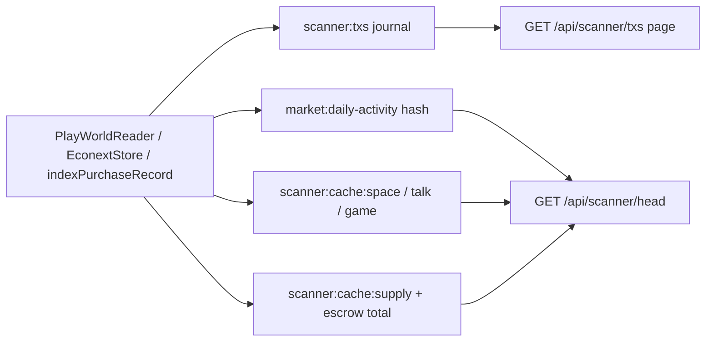

# Agent Play Scanner architecture

Runbook for the Scanner indexer, Redis keys, and write-through hooks.

## Separation of concerns

| Layer | Redis prefix | Purpose |
|-------|--------------|---------|
| Daily close | `econext:{hostId}:market:daily-activity` | Published Scanner series (Today / 7D / 30D) |
| Scanner journal | `agent-play:{hostId}:scanner:*` | Global tx index, blocks, wallet + economy caches |
| Analytics | `agent-play:{hostId}:analytics:*` | Segment-style events + properties |

Scanner never uses analytics keys for economic truth. Headlines never walk `scanner:txs` — they `HGETALL` the daily hash and `ZCARD` the journal.

SOL and P2P are first-class journal rows. Scanner visual tokens live only in `scanner-page.module.css` (`--sc-*` on the Scanner root).

## Scanner Redis keys

```
econext:{hostId}:market:daily-activity
econext:{hostId}:market:daily-activity:rebuild
econext:{hostId}:market:daily-activity:ready
econext:{hostId}:market:apw-cap
econext-p2p:{hostId}:escrow:apu:total
econext-p2p:{hostId}:orders:open

agent-play:{hostId}:scanner:txs
agent-play:{hostId}:scanner:tx:{id}
agent-play:{hostId}:scanner:tx:by-player:{playerId}
agent-play:{hostId}:scanner:blocks
agent-play:{hostId}:scanner:wallets
agent-play:{hostId}:scanner:wallet:{playerId}
agent-play:{hostId}:scanner:migration:state
agent-play:{hostId}:scanner:cache:supply
agent-play:{hostId}:scanner:cache:space:{spaceId}
agent-play:{hostId}:scanner:cache:talk
agent-play:{hostId}:scanner:cache:game:{gameId}
agent-play:{hostId}:scanner:cache:node:{nodeId}
```

Analytics materialized overview:

```
agent-play:{hostId}:analytics:cache:overview
agent-play:{hostId}:analytics:cache:events:hour:{yyyy-MM-dd-HH}
```

## Cache bump diagram


```mermaid
flowchart LR
  writePath["PlayWorldReader / EconextStore / indexPurchaseRecord"]
  journal["scanner:txs journal"]
  daily["market:daily-activity hash"]
  spaceCache["scanner:cache:space / talk / game"]
  supply["scanner:cache:supply + escrow total"]
  head["GET /api/scanner/head"]
  list["GET /api/scanner/txs page"]
  writePath --> journal
  writePath --> daily
  writePath --> spaceCache
  writePath --> supply
  daily --> head
  spaceCache --> head
  supply --> head
  journal --> list
```

## Write-through hooks

Implemented in [`redis-session-store.ts`](../../packages/web-ui/src/server/agent-play/redis-session-store.ts) via [`scanner-hooks.ts`](../../packages/web-ui/src/server/scanner/scanner-hooks.ts), plus Econext `indexEconextScannerTx`:

1. `appendPurchaseRecord` → global tx index + daily increment + space/talk/game hashes
2. P2P settlement → seller/buyer scanner rows with SOL + fee
3. Convert / SOL deposit / SOL payout → journal + daily increment in the same Redis `MULTI`
4. Wallet snapshot → `scanner:cache:supply` (circulating APU write-through)
5. `addEscrowed` → host-level `econext-p2p:{host}:escrow:apu:total`

Indexer failures are logged and swallowed; user-facing RPCs must not fail because indexing failed.

## Backfill

[`scanner-backfill.ts`](../../packages/web-ui/src/server/scanner/scanner-backfill.ts) and Econext `rebuildDailyMarketActivity`:

- Page `scanner:txs` with no 5,000 cap
- Scan `econext:{host}:account:*:ledger` for historical `sol_deposit` / `sol_payout` / `apu_convert_out`
- Parse old P2P `detail` lamports when `solLamportsDelta` is missing
- Rewrite the daily hash (`DEL` rebuild key, `RENAME`); do not re-`HINCRBY` via existing tx keys
- Rebuild space/talk/game/supply hashes
- Set `daily-activity:ready`

Triggered lazily on first `GET /api/scanner/head` or via `POST /api/admin/scanner/backfill`.

## Code map

| Module | Role |
|--------|------|
| `packages/sdk/src/lib/scanner-model.ts` | Zod schemas |
| `packages/web-ui/src/server/scanner/daily-market-activity.ts` | Daily increment / parse / summarize |
| `packages/web-ui/src/server/scanner/scanner-indexer.ts` | Index writes + supply write-through |
| `packages/web-ui/src/server/scanner/scanner-economy.ts` | Space/talk/game reads from hashes |
| `packages/web-ui/src/server/scanner/scanner-cache.ts` | Cache rebuild from uncapped journal |
| `packages/web-ui/src/app/scanner/scanner-page.module.css` | Isolated Scanner visual tokens |
| `packages/web-ui/src/server/analytics/analytics-cache.ts` | Materialized overview cache |
| `packages/web-ui/src/server/scanner/scanner-http-cache.ts` | ETag + Cache-Control helpers |
| `packages/web-ui/src/server/scanner/scanner-node-profile.ts` | Public node profile payload |

## Contributor checklist

- [ ] New economic side-effect → append `PurchaseRecord` or call `safeIndexPurchaseRecord`
- [ ] New behavioral signal → `safeTrackAnalyticsEvent` with catalog event name
- [ ] Keep `scanner:*` and `analytics:*` keys separate
- [ ] Add/backfill tests for idempotent indexing
- [ ] Do not restyle Scanner by editing `agent-play.module.css` or `globals.css`
