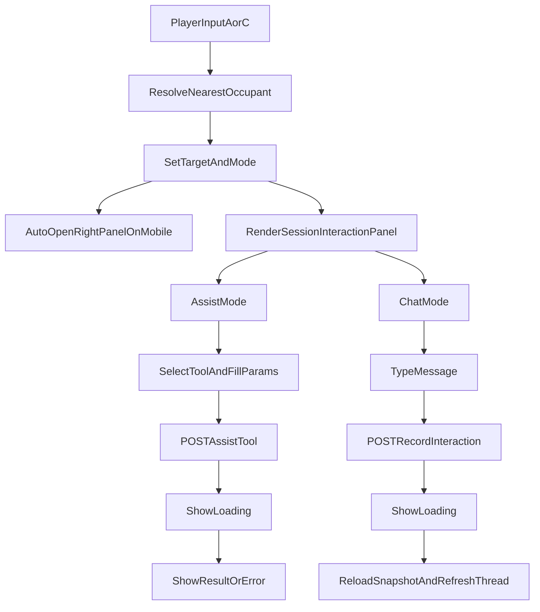

# Human Agent Interaction UX (2026-04-10)

This note documents the updated human-to-agent interaction model in `packages/play-ui`, including state flow, API contracts, mobile behavior, and troubleshooting guidance.

## Goals

- Improve discoverability of nearby interactions.
- Move Assist/Chat interactions into a dedicated session-side workflow.
- Keep interaction behavior consistent across desktop and mobile.
- Standardize request payload contracts used by the UI.

## What changed

### Canvas and proximity UX

- Occupant labels now use full names (no forced truncation).
- A proximity prompt is shown above the nearby occupant:
  - `A: for assist`
  - `C: for chat`
- Keyboard A/C still trigger proximity actions, and now also set interaction context.

### Session interaction panel

A dedicated session interaction panel was added in play UI to centralize player-to-agent workflows:

- **Assist Action**
  - tool selection
  - visible tool description
  - dynamic parameter form from tool fields
  - send + loading progress
  - inline result/error feedback
- **Chat Action**
  - chat thread
  - composer + send
  - pending/loading indicator during request

### Mobile behavior

- Mobile side controls now support programmatic panel opening.
- When the player triggers A/C on mobile, the right panel auto-opens for immediate interaction.

### Overlay responsibility update

- Agent chat overlays remain display-oriented.
- Interactive Assist workflow is centralized in the session interaction panel.

## API contracts (UI payloads)

### Proximity action

`POST <play-api>/proximity-action?sid=...`

Body:

```json
{
  "fromPlayerId": "__human__",
  "toPlayerId": "<agentId>",
  "action": "assist|chat|zone|yield"
}
```

### Assist invocation

`POST <play-api>/api/agent-play/assist-tool?sid=...`

Body:

```json
{
  "targetPlayerId": "<agentId>",
  "toolName": "assist_*",
  "args": { "fieldName": "value" }
}
```

### Chat send

`POST <play-api>/sdk/rpc?sid=...`

Body:

```json
{
  "op": "recordInteraction",
  "payload": {
    "playerId": "<agentId>",
    "role": "user",
    "text": "<message>"
  }
}
```

## Interaction state model

The session interaction UI follows this state:

- `activeAgentId`: currently targeted occupant.
- `mode`: `assist` or `chat`.
- `busy`: request in-flight, input disabled, progress visible.
- `selectedTool`: active assist tool for parameter collection.

The model is updated by keyboard proximity triggers and snapshot refreshes.

## Data / interaction flow



## Accessibility and UX behavior

- Keyboard shortcuts do not trigger while typing in text inputs/textarea/contenteditable.
- Pending state disables buttons/inputs to prevent duplicate requests.
- Mobile users are taken directly to the interactive panel after A/C proximity action.

## Testing guidance

Add or maintain behavior tests for:

- side panel programmatic open on mobile
- assist request payload shape (`targetPlayerId`)
- proximity key mapping and nearest-occupant selection
- interaction panel loading/pending transitions

## Troubleshooting

- If Assist fails with `invalid body`, verify `targetPlayerId` is sent.
- If A/C appears to do nothing on mobile, verify right panel open hooks are wired.
- If chat appears stale, ensure snapshot refresh runs after interaction requests.
