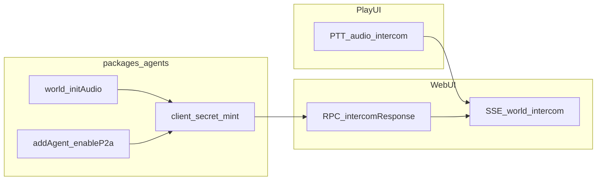

# P2A realtime implementation hub

This folder documents **OpenAI Realtime** integration for Agent Play **without LiveKit** using SDK-managed realtime client secret minting (`RemotePlayWorld.initAudio()`) and transport through `addAgent`.

## Related product architecture

- [Agent Play P2A implementation architecture](../agent-play-p2a-implementation.md) — Ringer, assist tools, canvas UX (broader P2A product story).
- [Intercom-address architecture](../intercom-address.md) — `intercom-address://{channelKey}` routing.

## Per-agent flag

Enable realtime voice handling for a specific automation agent at registration time:

```ts
await world.addAgent({
  name: "…",
  type: "…",
  nodeId: "…",
  agent: langchainRegistration(agent),
  enableP2a: "on", // or "off" (default when omitted)
});
```

When **`enableP2a: "on"`** and SDK audio init is enabled, agent registration includes `realtimeWebrtc` client secret metadata. Keys are **never** sent from the browser for this path.

## Doc map

| Document | Contents |
|----------|----------|
| [wire-and-contracts.md](./wire-and-contracts.md) | `requestId`, intercom `stream` / `completed`, optional `enableP2a` on add-agent wire |
| [realtime-openai-bridge.md](./realtime-openai-bridge.md) | SDK + agents minting flow, no LiveKit policy, secrets |
| [packages-and-sdk-surface.md](./packages-and-sdk-surface.md) | SDK vs agents responsibilities; browser bundle constraints |

## High-level flow


