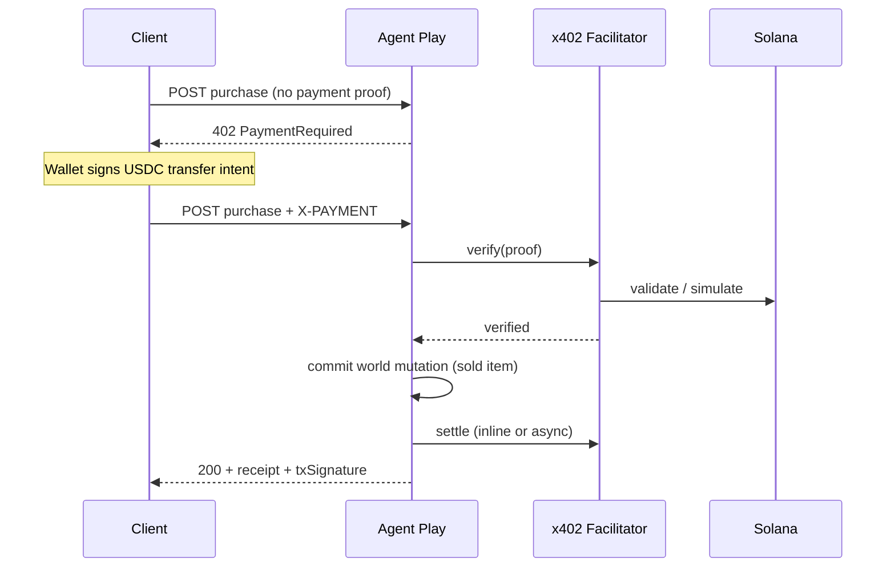

# x402 overview

How the [x402](https://github.com/coinbase/x402) protocol fits Agent Play, and why it replaces the internal wallet for production payments.

**See also:** [Payment catalog](03-payment-catalog.md) · [Settlement & idempotency](04-settlement-and-idempotency.md) · [Hub](README.md)

---

## What x402 is

x402 is an open payment protocol that uses the HTTP **402 Payment Required** status code. A resource server responds with payment terms; the client (browser, SDK, or AI agent) signs a payment and retries the same request with proof in a payment header.

Properties that matter for Agent Play:

| Property | Benefit |
|----------|---------|
| **HTTP-native** | Same transport as `/api/agent-play/sdk/rpc` — no separate billing API to learn |
| **Machine-readable** | Agents and scripts can pay without custom Stripe integrations |
| **Stablecoin settlement** | USDC on Solana — sub-cent fees, fast confirmation |
| **Facilitator pattern** | Server verifies/settles via a trusted service; Agent Play never holds private keys |

Agent Play already treats money as **consequence in the world** (sold items, purchase audit rows, talk debits). x402 moves **settlement** on-chain while keeping **world state** server-authoritative in Redis.

---

## The 402 flow in one request



**Unpaid reads stay 200:** `getWorldSnapshot`, `inspectSpace`, journey events — no x402.

---

## Roles in the x402 model

| Role | Agent Play mapping |
|------|-------------------|
| **Resource server** | `web-ui` RPC route + REST handlers |
| **Client** | Watch UI, playground, `RemotePlayWorld` |
| **Facilitator** | Hosted or self-hosted verify/settle service |
| **Buyer** | Overworld user (linked Solana wallet + main node auth) |
| **Seller** | Space owner or agent operator (linked payout wallet) |

---

## Solana + USDC

v1 targets **Solana** with **SPL USDC**:

- Network: `solana:devnet` (development) → `solana:mainnet-beta` (production)
- Mint: configured via `AGENT_PLAY_USDC_MINT`
- Amounts: stored as **micro-USDC** integer strings in settlement records (6 decimals)

**Price display:** catalog items keep `priceUsd` for UI labels. Settlement uses **1 USD = 1 USDC** (1:1 micro-unit mapping) unless doc [03 — Payment catalog](03-payment-catalog.md) defines a buffer for mainnet.

---

## What changes vs internal wallet

| Today (internal) | Target (x402) |
|------------------|---------------|
| Redis `balanceUsd` debited | On-chain USDC transfer verified by facilitator |
| Lazy `$70` seed on first read | No seed; user must hold USDC |
| `powerUps` earn/spend | Deprecated in x402 mode (see [08 — Migration](08-migration-from-internal-wallet.md)) |
| `purchase` RPC only | `purchase` + **402** + `X-PAYMENT` retry |
| Payee implicit (demo) | Payee = resolved settlement profile (owner / agent operator) |

World semantics **unchanged:**

- Item `sale.status` → `"sold"`
- `PurchaseRecord` appended (extended with `settlement` block)
- Fanout `space:amenity_content_updated`

---

## Agent Play resource identifiers

Each priced operation gets a stable **resource id** (x402 `resource` field), for example:

```
agent-play://space/{spaceId}/amenity/{kind}/item/{itemId}
agent-play://talk/{agentId}/tick
agent-play://space/create
agent-play://space/{spaceId}/lease/{kind}
```

Full catalog: [03 — Payment catalog](03-payment-catalog.md).

---

## Facilitator responsibilities

The facilitator (external to Agent Play):

1. **Verify** — payment proof matches amount, asset, payee, network
2. **Settle** — submit or confirm on-chain transfer
3. **Return** — tx signature and reference id for audit

Agent Play **must not** mark an item sold until verify succeeds. See [04 — Settlement & idempotency](04-settlement-and-idempotency.md).

Configuration: [07 — AQL & platform ops](07-aql-and-platform-ops.md).

---

## Production checklist

- [ ] Understand 402 vs 401 vs 428 (`WALLET_NOT_LINKED`) error semantics
- [ ] Choose facilitator (hosted CDP vs self-hosted) before implementation
- [ ] Configure devnet USDC mint and treasury address
- [ ] Read [09 — Security & compliance](09-security-and-compliance.md) before mainnet

---

## Related

- [x402 specification v2 (GitHub)](https://github.com/coinbase/x402/blob/main/specs/x402-specification-v2.md)
- [Current internal payments doc](../../payments-wallets-and-talk-billing.md)
- [Architecture plan](../../x402-solana-payments-plan.md)
