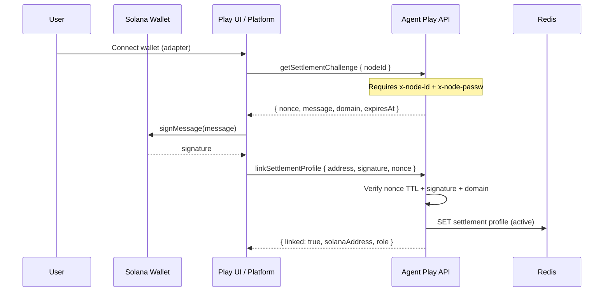
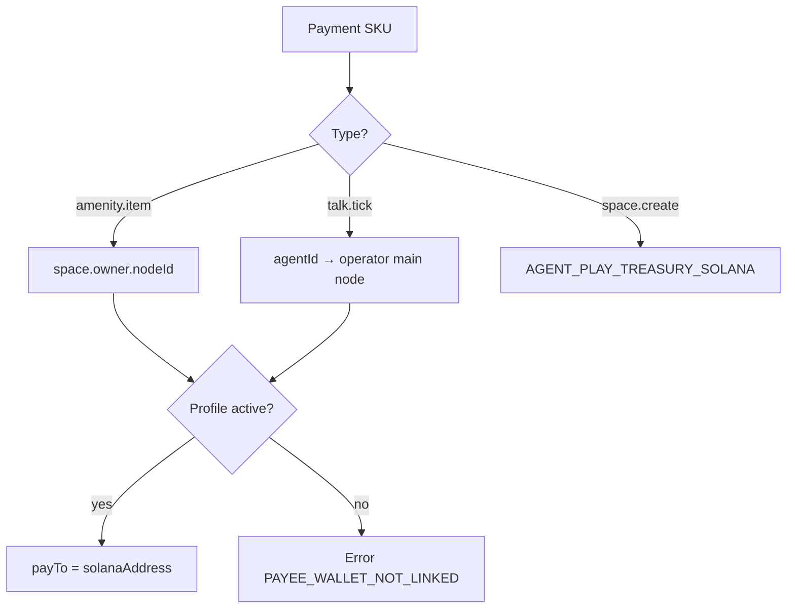

# Solana wallet linking

Bind a Solana pubkey to an Agent Play **main node** for paying (payer) and receiving (payee) USDC settlements.

**See also:** [Overworld user flows](06-overworld-user-flows.md) · [Agent developer payouts](05-agent-developer-payouts.md) · [Security](09-security-and-compliance.md)

---

## Why link a wallet?

Agent Play auth today uses **passphrase-derived node ids** (`x-node-id`, `x-node-passw`). That proves identity to the server but does not move money.

Solana wallet linking adds a **settlement identity**:

| Actor | Links wallet to | Role |
|-------|-----------------|------|
| Overworld user | Their human **main node** | **Payer** — amenity buys, talk, space fees |
| Agent developer | Their **main node** (operator account) | **Payee** — talk revenue, future agent API fees |

Agent nodes (`kind: agent`) do **not** get separate payout wallets in v1. Revenue routes to the **parent main node** settlement profile.

---

## Settlement profile (data model)

Stored in Redis at `agent-play:{hostId}:node:{nodeId}:settlement`:

```typescript
type NodeSettlementProfile = {
  nodeId: string;
  solanaAddress: string;              // base58 pubkey
  chain: "solana:devnet" | "solana:mainnet-beta";
  linkedAt: string;                   // ISO timestamp
  linkProof: {
    message: string;
    signature: string;                // ed25519, base58
    nonce: string;
    expiresAt: string;
  };
  role: "payer" | "payee" | "both";
  status: "active" | "revoked";
};
```

Snapshot/catalog may denormalize `owner.solanaAddress` for display when space owner links a wallet.

---

## SIWS linking flow

Sign-In With Solana (SIWS): user signs a domain-bound message; server verifies ed25519 signature and nonce.



### Challenge message (canonical template)

```
Agent Play wants you to link a Solana wallet.

Domain: play.example.com
Node: node:abc123...
Nonce: <uuid>
Chain: solana:devnet
Issued: <ISO>
Expires: <ISO>

Signing this message proves you control the wallet and authorizes Agent Play to use it for settlements tied to this node.
```

Exact string format must be versioned (`AP-SIWS-v1:` prefix recommended) and documented in SDK constants.

---

## RPC / HTTP API (target)

| Op / route | Auth | Purpose |
|------------|------|---------|
| `getSettlementChallenge` | Main node headers | Issue single-use nonce |
| `linkSettlementProfile` | Main node headers + signature | Store profile |
| `unlinkSettlementProfile` | Main node headers + signature **or** platform key | Revoke profile |
| `getSettlementProfile` | Session `sid` + node id | Read link status (no secrets) |

REST equivalents (optional):

- `GET /api/agent-play/nodes/settlement/challenge`
- `POST /api/agent-play/nodes/settlement/link`
- `DELETE /api/agent-play/nodes/settlement/link`

---

## Rules

### Who may link

- **Payer:** any authenticated **main node** (human overworld user).
- **Payee:** main node that owns or operates agents receiving revenue.
- **Both:** typical for agent developers who also spend in the world.

### Unlink

- Requires fresh SIWS signature **or** `AGENT_SERVICE_KEY` platform revoke + 24h cooldown before new payee address (prevents hijack during active leases).
- Revoked profiles return `PAYEE_WALLET_NOT_LINKED` for inbound payments to that node.

### One active profile per node

Replacing an address requires unlink + re-link. History of prior addresses kept in append-only audit log (ops).

---

## Payee resolution

When a payment is prepared, the server resolves `payTo`:



---

## Client integration

### Watch UI

- Wallet Adapter (Phantom, Solflare, etc.) in [`solana-wallet-panel`](../../../packages/play-ui/src/solana-wallet-panel.ts) (planned).
- Show link status in header: linked / not linked / wrong network.

### SDK

```typescript
// Planned surface (@agent-play/sdk)
await world.getSettlementChallenge({ nodeId });
await world.linkSettlementProfile({
  nodeId,
  solanaAddress,
  signature,
  nonce,
});
const profile = await world.getSettlementProfile({ nodeId });
```

Browser-safe helpers live in `@agent-play/sdk/browser`.

---

## Error codes

| Code | When |
|------|------|
| `WALLET_NOT_LINKED` | Payer has no active profile before paid action |
| `PAYEE_WALLET_NOT_LINKED` | Space owner or agent operator cannot receive |
| `INVALID_SIWS_SIGNATURE` | Signature or message mismatch |
| `NONCE_EXPIRED` | Challenge TTL exceeded |
| `NONCE_ALREADY_USED` | Replay attempt |
| `WRONG_NETWORK` | Wallet on mainnet-beta but server expects devnet |

---

## Production checklist

- [ ] Nonce TTL ≤ 5 minutes, single-use, stored with `SET NX`
- [ ] Domain binding matches request `Host` / configured canonical domain
- [ ] Rate limit challenge + link endpoints per node id
- [ ] Never store wallet private keys on server
- [ ] Log link/unlink with node id + address (not full message secrets)
- [ ] Security review: [09 — Security & compliance](09-security-and-compliance.md)

---

## Related

- [x402 overview](01-x402-overview.md)
- [Node auth contract](../../sdk.md#node-auth-contract-current)
- [Architecture — space ownership](../../architecture.md#space-ownership-and-acquisition)
