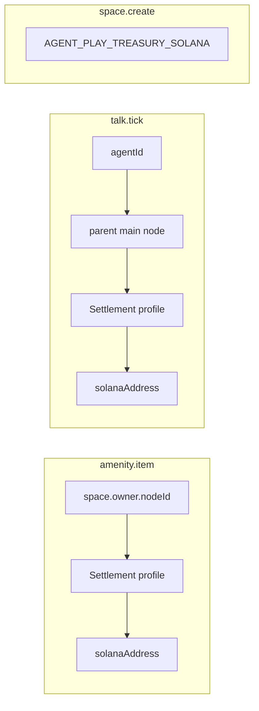

# Payment catalog

Every priced operation in Agent Play x402 mode: resource ids, payees, amounts, and error semantics.

**See also:** [x402 overview](01-x402-overview.md) · [Settlement](04-settlement-and-idempotency.md) · [Platform ops](07-aql-and-platform-ops.md)

---

## Design principles

1. **One resource id per billable unit** — idempotency keys derive from resource + payer node + window.
2. **Payee resolved server-side** — clients cannot override `payTo`.
3. **Display in USD, settle in USDC** — `priceUsd` on items; settlement uses micro-USDC integers.
4. **Fail closed** — missing payer or payee link → error before 402.

---

## SKU reference

| SKU | RPC / trigger | Resource id template | Payee | Amount source |
|-----|---------------|----------------------|-------|---------------|
| `amenity.item` | `purchase` | `agent-play://space/{spaceId}/amenity/{kind}/item/{id}` | Space owner settlement | Item `priceUsd` |
| `talk.tick` | `talkSessionTick` | `agent-play://talk/{agentId}/viewer/{viewerNodeId}/tick/{seq}` | Agent operator main node | `costForSeconds(TALK_TICK_SECONDS)` |
| `talk.start` | `talkSessionStart` (optional deposit) | `agent-play://talk/{agentId}/viewer/{viewerNodeId}/deposit` | Agent operator | Configurable deposit |
| `space.create` | `createSpace` | `agent-play://space/create/{requestId}` | Platform treasury | Platform fee table |

`kind` ∈ `shop` | `supermarket` | `car_wash`.

---

## Amount rules

### USDC mapping (v1 default)

```
amountMicro = floor(priceUsd * 1_000_000)
```

Examples:

| priceUsd | amountMicro (USDC) |
|----------|------------------|
| 1.25 | 1250000 |
| 0.025 (1 talk second) | 25000 |
| 18.50 | 18500000 |

**Open decision:** mainnet buffer (+1%) for volatility — document in env `AGENT_PLAY_USDC_BUFFER_BPS` if enabled.

### Talk billing

From SDK constants (unchanged semantics, new settlement rail):

| Constant | Value |
|----------|-------|
| `TALK_PRICE_PER_60S_USD` | 1.5 |
| `TALK_PRICE_PER_SECOND_USD` | 0.025 |
| `TALK_TICK_SECONDS` | 10 |

Per tick: `costForSeconds(10)` → **$0.25** USDC before rounding helper.

**Alternative (v1.1):** session voucher — pay 60s upfront via `talk.start` SKU; ticks consume voucher locally (lower chain volume). See [Agent developer payouts](05-agent-developer-payouts.md).

---

## Payee routing detail



If `space.owner.nodeId` is missing, fall back to platform treasury and log warning (dev only). Production should require owner node id at space creation.

---

## Platform fee (optional)

| Env | Purpose |
|-----|---------|
| `AGENT_PLAY_PLATFORM_FEE_BPS` | Basis points taken from amenity.item (e.g. 250 = 2.5%) |
| `AGENT_PLAY_TREASURY_SOLANA` | Receives platform share |

Split implemented in `PaymentGate` quote builder — single payTo in v1; split settlement in v1.1 via facilitator batch.

---

## Devnet configuration

| Variable | Example |
|----------|---------|
| `AGENT_PLAY_SETTLEMENT_NETWORK` | `solana:devnet` |
| `AGENT_PLAY_USDC_MINT` | Devnet USDC mint (Circle faucet / documented test mint) |
| `AGENT_PLAY_TREASURY_SOLANA` | Platform devnet pubkey |

Document mint addresses per environment in host runbook ([07 — Platform ops](07-aql-and-platform-ops.md)).

---

## 402 response shape (illustrative)

When `AGENT_PLAY_PAYMENTS_MODE=x402` and payment proof is missing:

```http
HTTP/1.1 402 Payment Required
Content-Type: application/json

{
  "error": "PAYMENT_REQUIRED",
  "paymentRequired": {
    "resource": "agent-play://space/abc/amenity/shop/item/item-1",
    "amountMicro": "24990000",
    "asset": "USDC",
    "network": "solana:devnet",
    "payTo": "7xKX...",
    "expiresAt": "2026-06-11T12:05:00Z",
    "idempotencyKey": "purchase:node:viewer:item-1:..."
  }
}
```

Exact field names follow x402 v2 `PaymentRequired` schema; Agent Play adds `idempotencyKey` for Redis intent correlation.

---

## Error codes (payment catalog)

| Code | HTTP | Meaning |
|------|------|---------|
| `PAYMENT_REQUIRED` | 402 | Proof missing; body includes terms |
| `PAYMENT_INVALID` | 402 | Verify failed |
| `PAYMENT_EXPIRED` | 402 | Quote TTL exceeded |
| `PAYMENT_ALREADY_CONSUMED` | 409 | Idempotency replay |
| `ITEM_ALREADY_SOLD` | 409 | Item no longer available |
| `WALLET_NOT_LINKED` | 428 | Payer must link Solana wallet |
| `PAYEE_WALLET_NOT_LINKED` | 503 | Seller cannot receive |
| `INSUFFICIENT_USDC` | 402 | Facilitator reports low balance |

---

## Production checklist

- [ ] Resource ids stable across retries (no random suffix per 402)
- [ ] Quotes expire ≤ 5 minutes
- [ ] Payee address matches catalog resolution in verify step
- [ ] Integration tests per SKU on devnet
- [ ] Price list reviewed before mainnet (`AGENT_PLAY_SETTLEMENT_NETWORK=solana:mainnet-beta`)

---

## Related

- [Overworld flows — buying items](06-overworld-user-flows.md#amenity-purchases)
- [Spaces & leases](06-overworld-user-flows.md#space-acquisition)
- [Master plan](../../x402-solana-payments-plan.md#8-payment-catalog-starter--doc-d-expands)
