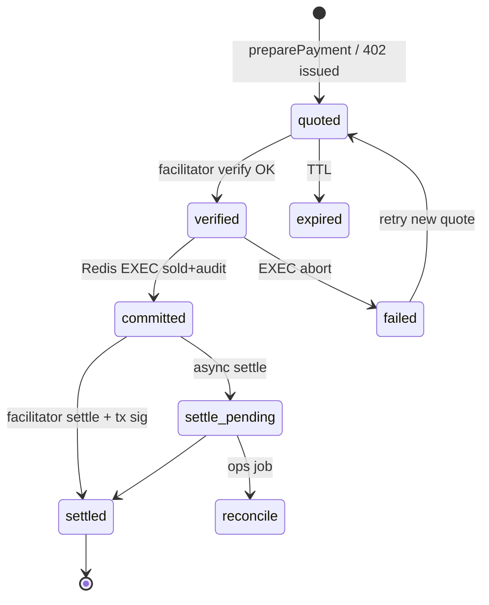
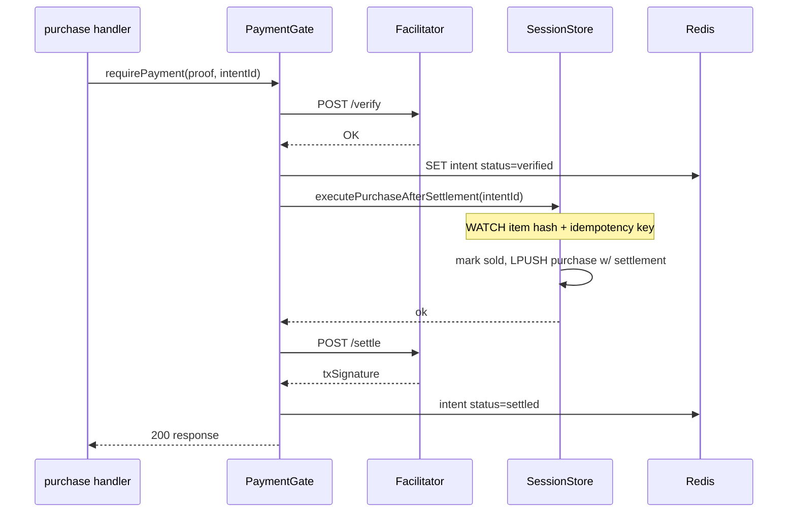

# Settlement and idempotency

How Agent Play verifies x402 payments, commits world state atomically, and handles failures without double-selling or lost funds.

**See also:** [Payment catalog](03-payment-catalog.md) · [Observability](10-observability.md) · [Security](09-security-and-compliance.md)

---

## Core rule

> **Never mutate world state (sold item, lease row, talk session) until facilitator verify succeeds.**  
> **Never verify the same idempotency key twice for two different world commits.**

Internal wallet today uses Redis `WATCH`/`MULTI` on wallet + item. x402 adds a **payment intent** layer before the same commit path.

---

## Payment intent lifecycle



---

## Redis keys

| Key | Purpose | TTL |
|-----|---------|-----|
| `agent-play:{hostId}:payment-intent:{id}` | Intent JSON (status, resource, amounts) | 24h after terminal state |
| `agent-play:{hostId}:idempotency:{key}` | Maps key → intent id + result | 7d |
| `agent-play:{hostId}:node:{nodeId}:settlement` | Wallet link profile | none (until revoked) |

### Intent record (schema)

```typescript
type PaymentIntent = {
  id: string;
  idempotencyKey: string;
  status: "quoted" | "verified" | "committed" | "settled" | "failed" | "expired";
  resource: string;
  sku: string;
  payerNodeId: string;
  payeeAddress: string;
  amountMicro: string;
  network: string;
  createdAt: string;
  verifiedAt?: string;
  committedAt?: string;
  txSignature?: string;
  facilitatorRef?: string;
  worldOp: { op: string; payload: Record<string, unknown> };
};
```

---

## Commit flow (amenity purchase)



### Branching on payments mode

| `AGENT_PLAY_PAYMENTS_MODE` | Behavior |
|----------------------------|----------|
| `internal` | Legacy `balanceUsd` debit only |
| `dual` | x402 required; internal debit disabled for new purchases |
| `x402` | 402 without proof; no `PlayerWallet` reads |

Implementation: single `executePurchase` entry with strategy pattern in `redis-session-store.ts`.

---

## Idempotency

**Key composition (example):**

```
purchase:{payerNodeId}:{resource}:{quoteVersion}
```

**Client retry:** same `X-PAYMENT` + same `Idempotency-Key` header → return cached 200 with original `txSignature`.

**Server:**

```typescript
// Pseudocode
const existing = await redis.get(idempotencyKey);
if (existing?.status === "committed") {
  return existing.response;
}
```

Prevents double-sell when client retries after timeout.

---

## Ordering: verify → commit → settle

| Order | Pros | Cons |
|-------|------|------|
| **Verify → commit → settle (recommended v1)** | No sold item without verified payment | Rare settle failure after commit needs reconciliation |
| Verify → settle → commit | Stronger fund guarantee | Slower UX; chain latency blocks gameplay |

**Reconciliation job** (see [10 — Observability](10-observability.md)): intents in `committed` + no `txSignature` after N minutes → alert + manual/auto settle retry.

---

## Extended purchase record

When `paymentsMode` is `x402` or `dual`, append:

```typescript
settlement: {
  network: "solana:devnet" | "solana:mainnet-beta";
  asset: "USDC";
  amountMicro: string;
  payerAddress: string;
  payeeAddress: string;
  txSignature: string;
  x402Resource: string;
  facilitatorRef?: string;
  idempotencyKey: string;
}
```

`priceUsd` retained for display and legacy export.

---

## Failure modes

| Scenario | User-visible | Server action |
|----------|--------------|---------------|
| Facilitator down on verify | 503 + `Retry-After` | No commit |
| Verify OK, EXEC fails | 500 | Intent `failed`; item stays available |
| Commit OK, settle fails | 200 + `settlementPending: true` | Reconciliation job |
| Duplicate purchase race | 409 `ITEM_ALREADY_SOLD` | One winner only |
| Expired quote | 402 new quote | New intent id |

**Facilitator down policy:** fail closed for new purchases; in-flight talk sessions grace one tick then end with message.

---

## Talk session settlement

Talk ticks generate **high-frequency** intents. Mitigations:

1. **Batch ticks** — one verify per 10s tick (default).
2. **Session voucher** — prepaid SKU; ticks debit voucher in Redis only ([05 — Agent payouts](05-agent-developer-payouts.md)).
3. **Idempotency per tick seq** — resource id includes monotonic `seq` from talk session state.

---

## Production checklist

- [ ] `WATCH`/`MULTI` covers item + idempotency key (same as today’s purchase tests)
- [ ] Zero commits with `status != verified` (assert in tests + metric)
- [ ] Stuck intent sweeper cron documented in [07 — Platform ops](07-aql-and-platform-ops.md)
- [ ] Idempotency TTL ≥ max client retry window
- [ ] Load test: 50 concurrent purchases, 1 item → 1 success

---

## Related

- [Current executePurchase tests](../../../packages/web-ui/src/server/agent-play/session-store-space-content.test.ts)
- [Internal payments doc](../../payments-wallets-and-talk-billing.md#payments-amenity-purchases)
- [Migration](08-migration-from-internal-wallet.md)
