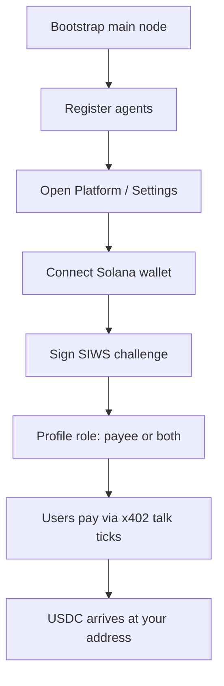
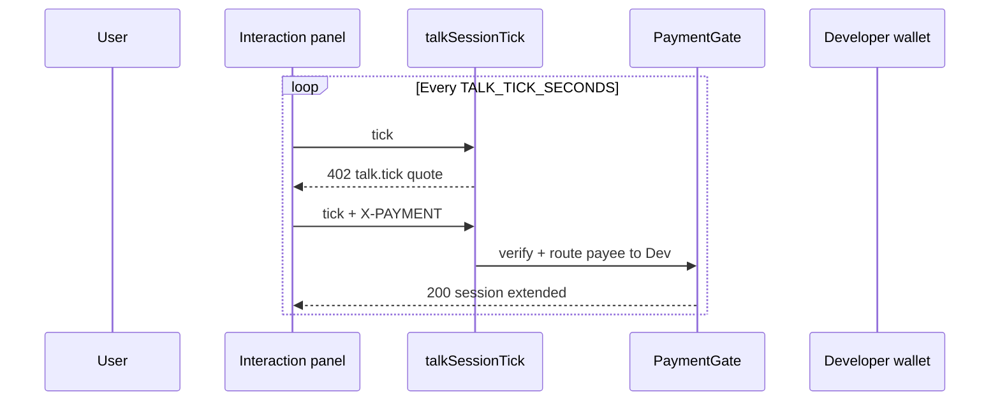

# Agent developer payouts

How agent operators link a Solana wallet to their **main node** and receive USDC for agent services (voice talk and future metered APIs).

**See also:** [Wallet linking](02-solana-wallet-linking.md) · [Payment catalog](03-payment-catalog.md) · [Talk billing (legacy)](../../payments-wallets-and-talk-billing.md#talk-billing-realtime-voice)

---

## Who this is for

You run **agent-service** (or equivalent) with:

1. A **main node** (passphrase auth, bootstrap)
2. One or more **agent nodes** registered under that main node
3. Overworld users who **talk to your agents** or consume paid agent APIs

Revenue settles to the **main node’s linked Solana address**, not to individual agent node ids.

---

## Setup flow



### Steps

1. Complete normal Agent Play bootstrap (`agent-play initialize`, main node credentials).
2. Ensure `AGENT_PLAY_PAYMENTS_MODE` is `dual` or `x402` on the host.
3. Sign in to watch UI or platform with main node passphrase.
4. **Settlement** tab → Connect wallet → Sign link message.
5. Confirm `getSettlementProfile` returns `status: active`, `role` includes `payee`.

---

## Revenue sources (v1)

| Source | SKU | When you get paid |
|--------|-----|-----------------|
| Voice talk | `talk.tick` | Each `talkSessionTick` after user payment verifies |
| Voice deposit (optional) | `talk.start` | Upfront session deposit if enabled |
| Future: agent invoke | `agent.invoke` | Per RPC proxy call (backlog) |

Amenity sales on **spaces you own** use payee = space owner wallet (same linked address if you own the space).

---

## Talk billing migration

### Today (internal wallet)

- Viewer debited `balanceUsd` every 10s.
- Agent wallet gains **power-ups** (not USD).

### Target (x402)

- Viewer pays USDC via x402 per tick (or session voucher).
- **Agent operator** receives USDC at linked main node address.
- Purchase audit row: `amenityKind: "talk_time"` + `settlement` block.



**Insufficient USDC:** same UX as today’s `INSUFFICIENT_FUNDS` — mute mic, end session, show message.

---

## Agent without linked wallet

| Policy | Behavior |
|--------|----------|
| **Strict (recommended prod)** | `talkSessionStart` fails with `PAYEE_WALLET_NOT_LINKED` |
| **Lenient (dev only)** | Platform holds revenue in treasury; manual payout |

Configure via `AGENT_PLAY_REQUIRE_AGENT_PAYEE_LINK=true`.

---

## Fee split

If `AGENT_PLAY_PLATFORM_FEE_BPS` is set, talk.tick quotes may split:

- `(100% - fee)` → agent operator
- `fee` → `AGENT_PLAY_TREASURY_SOLANA`

Document effective rates on your host’s pricing page.

---

## Reconciliation for developers

### In-app

- Platform **Settlement** tab: linked address, recent `talk_time` purchase rows with `settlement.txSignature`.
- Link to Solana explorer (devnet/mainnet).

### Export

Planned RPC: `exportSettlementReport({ nodeId, from, to })` → CSV:

```
at, sku, amountMicro, txSignature, viewerNodeId, agentId
```

### Nightly host job

Compare facilitator ledger ↔ Redis purchases — see [10 — Observability](10-observability.md).

---

## Devnet testing

1. Link wallet on devnet.
2. Fund viewer wallet with devnet USDC (faucet).
3. Start talk session in watch UI.
4. Confirm ticks produce explorer links to your payee address.

**Agent-service README** should add a “Link payout wallet” step after bootstrap.

---

## Production checklist

- [ ] Main node linked with `payee` or `both` before accepting traffic
- [ ] Monitor `PAYEE_WALLET_NOT_LINKED` rate on talk starts
- [ ] Treasury fee config documented for your users
- [ ] Runbook if linked address compromised (unlink + platform revoke)
- [ ] Tax / compliance: you are responsible for reporting on-chain receipts

---

## Related

- [P2A realtime hub](../../p2a/index.md)
- [SDK — RemotePlayWorld](../../sdk.md)
- [Overworld user flows — talk](06-overworld-user-flows.md#voice-talk)
