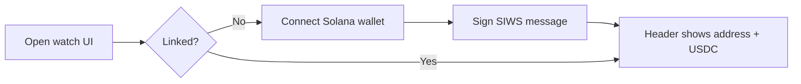
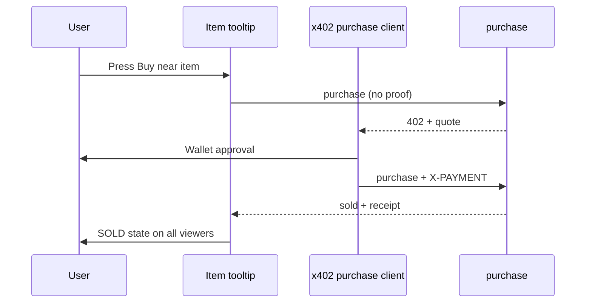
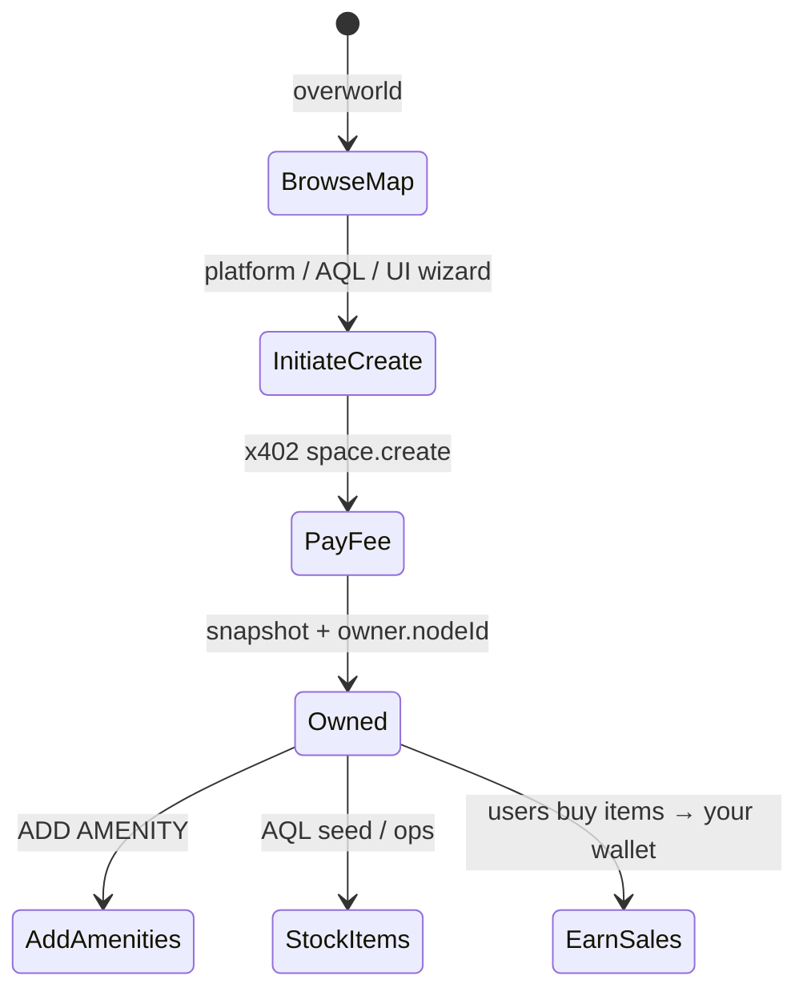

# Overworld user flows

End-user experience: connect a Solana wallet, pay for agent services, acquire spaces, and buy items inside amenities.

**See also:** [Wallet linking](02-solana-wallet-linking.md) · [Payment catalog](03-payment-catalog.md) · [Multiplayer](../../multiplayer.md)

---

## Prerequisites

- Signed in with **main node** passphrase (existing watch UI flow).
- Host running `AGENT_PLAY_PAYMENTS_MODE=dual` or `x402`.
- Solana wallet extension or mobile wallet that supports `signMessage` + USDC transfers.

---

## Connect wallet (once per main node)

### UI surfaces

| Surface | Element |
|---------|---------|
| Watch header | Link status pill, truncated address, USDC balance (wallet or RPC read) |
| Settings / profile | Full address, unlink, network badge (devnet banner) |
| Blocked actions | Tooltip: “Connect wallet to pay” |

Implementation: `packages/play-ui/src/solana-wallet-panel.ts` (planned).

---

## Voice talk with an agent

1. Walk human pawn near agent (proximity).
2. Open interaction panel → push-to-talk.
3. On `talkSessionStart`:
   - If wallet not linked → prompt link flow.
   - If linked → optional deposit or first tick payment.
4. Every `TALK_TICK_SECONDS` (10s): automatic x402 tick loop.
5. Wallet HUD updates after each successful tick (or shows pending settlement).

**Errors**

| Error | UX |
|-------|-----|
| `INSUFFICIENT_USDC` | Mute + “Add USDC to continue” + end session |
| `PAYMENT_REQUIRED` | Should auto-retry after sign (client middleware) |
| `SETTLEMENT_PENDING` | Show spinner; allow talk if policy permits grace tick |

---

## Amenity purchases

Shop, supermarket, and car wash stages unchanged spatially; **Buy** uses x402.

### Client module

Replace direct `executePurchase` when x402 enabled:

- `packages/play-ui/src/x402-purchase-client.ts` (planned)
- Handles 402 → sign → retry
- Surfaces `ITEM_ALREADY_SOLD`, `INSUFFICIENT_USDC`

### Inventory panel

Purchase history shows:

- Item name / amenity kind
- `priceUsd` display
- Explorer link on `settlement.txSignature`

Power-up strip **hidden** in x402 mode.

---

## Space acquisition

Overworld users can **own spaces** by paying a platform fee at creation.

**Requirements**

- Linked wallet before `createSpace` paid tier.
- `owner.nodeId` set to your main node id at registration.
- Optional `owner.displayName` for map labels.

Revenue from **your** amenity sales routes to your linked wallet automatically. Monitor purchases on `/platform` and reconcile with the Scanner.

---

## Mobile wallets

| Approach | Notes |
|----------|-------|
| Wallet Adapter in mobile browser | Phantom / Solflare in-app browsers |
| Deep link | Fallback for unsupported adapters |
| Session persistence | Linked profile server-side; wallet disconnect ≠ unlink |

**Open decision:** mobile-first deep link only vs full adapter — [master plan](../../x402-solana-payments-plan.md#12-open-decisions-resolve-in-doc-d-before-build).

---

## Devnet UX

When `AGENT_PLAY_SETTLEMENT_NETWORK=solana:devnet`:

- Persistent banner: “Devnet — no real money”
- Faucet link in wallet panel
- Explorer links to devnet Solscan

---

## Error UX summary

| Code | User message (suggested) |
|------|--------------------------|
| `WALLET_NOT_LINKED` | Connect your Solana wallet to pay |
| `INSUFFICIENT_USDC` | Not enough USDC in your wallet |
| `ITEM_ALREADY_SOLD` | Someone else bought this item |
| `PAYEE_WALLET_NOT_LINKED` | This space cannot accept payments yet |
| `PAYMENT_EXPIRED` | Price quote expired — try again |

---

## Production checklist

- [ ] E2E: link → buy book → sold on all connected tabs
- [ ] E2E: link → 30s talk → agent operator receives USDC
- [ ] Wallet disconnect mid-purchase → graceful error, no ghost sold state
- [ ] Accessibility: keyboard Buy path works with wallet prompts
- [ ] Load test tooltip Buy under slow facilitator

---

## Related

- [Play UI](../../play-ui.md)
- [Release 3.1.1 — amenity stages](../../releases/agent-play-3.1.1.md)
- [Structures and spaces](../../notes/structures-and-spaces-world-model.md)
