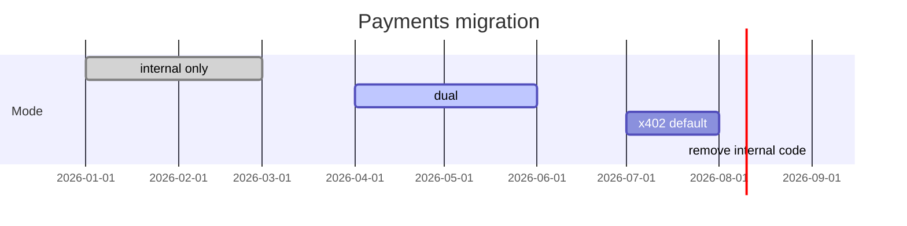

# Migration from internal wallet

Move existing Agent Play deployments from Redis `balanceUsd` / lazy `$70` seed to x402 + Solana without breaking world state or audit history.

**See also:** [Platform ops](07-aql-and-platform-ops.md) · [Payment catalog](03-payment-catalog.md) · [Legacy payments doc](../../payments-wallets-and-talk-billing.md)

---

## What is being replaced

| Component | Internal (legacy) | x402 target |
|-----------|-------------------|-------------|
| Balance source | Redis `player:wallet` JSON | On-chain USDC |
| Initial grant | `$70` lazy seed | None (user funds wallet) |
| Purchase debit | `balanceUsd -= price` | Facilitator verify |
| Talk billing | Debit viewer wallet | x402 per tick |
| Agent reward | `powerUps` on agent wallet | USDC to operator |
| PU bundles | `redeemWalletBundle` | Removed or off-chain loyalty later |
| AQL `SET WALLET` | Admin credit | Deprecated |

**Preserved:** purchase audit list shape (extended), sold item semantics, SSE fanout, journey/interaction logs.

---

## Migration phases

| Phase | `AGENT_PLAY_PAYMENTS_MODE` | User-visible |
|-------|----------------------------|--------------|
| **0** | `internal` | Current production |
| **1** | `dual` | Link wallet; new purchases use x402; hide `$70` HUD |
| **2** | `x402` | All priced RPCs require proof; no lazy seed |
| **3** | `x402` + code removal | Delete internal wallet paths |

---

## Phase 0 → 1 (dual)

### Server

1. Deploy settlement profile APIs + `PaymentGate` with `dual` flag.
2. Amenity `purchase`: if proof present → x402 path; else **402** (not internal debit).
3. Keep `GET .../wallet` for read-only legacy balance display (optional banner “migrating”).

### UI

1. Ship wallet link panel.
2. Buy flow uses x402 client when `paymentsMode != internal`.
3. Show both balances during dual (optional, time-boxed).

### Data

- **No automatic conversion** of `balanceUsd` to USDC.
- Optional one-time script: platform airdrop devnet USDC to beta users.

### Communication

- Email / docs: link Solana wallet before date X
- Demo hosts: stay on `internal` until ready

---

## Phase 1 → 2 (x402 only)

1. Set `AGENT_PLAY_PAYMENTS_MODE=x402` on production hosts.
2. Remove lazy seed code path in `getPlayerWallet`.
3. Disable `redeemWalletBundle` → **410 Gone** or explicit error.
4. Talk billing: internal debit removed; x402 ticks only.
5. Remove power-up earn on purchase.

### Redis cleanup (optional)

- Archive keys `agent-play:*:player:*:wallet` to cold storage
- Do **not** delete purchase lists — extend with settlement fields

---

## Phase 2 → 3 (code removal)

Remove or gate behind compile flag:

- `PlayerWalletSchema.balanceUsd` production usage
- `createInitialPlayerWallet` lazy seed
- `setPlayerWalletBalance` except break-glass platform tool
- `WALLET_BUNDLE_OFFERS` catalog
- `computeTalkAgentPowerUpsEarned` internal credit path

Keep schemas parseable for historical JSON (read old wallets as legacy).

---

## Purchase record compatibility

During `dual`, records may have:

- `priceUsd` only (legacy internal purchase before cutover)
- `settlement` block (x402 purchases)

Parsers use Zod `.optional()` on `settlement`.

Inventory UI:

- Legacy rows: show “Internal wallet” chip
- x402 rows: explorer link

---

## AQL and scripts

| Artifact | Action |
|----------|--------|
| `scripts/seed-amenities.aql` | Note x402; no `$70` assumption |
| `SET WALLET` in playground | Validator warning in dual; error in x402 |
| Docs | Banner on [payments-wallets-and-talk-billing.md](../../payments-wallets-and-talk-billing.md) |

---

## Rollback plan

If x402 rollout fails mid-phase:

1. Set `AGENT_PLAY_PAYMENTS_MODE=internal` (env only)
2. Redeploy previous UI bundle if needed
3. Items sold via x402 remain sold (irreversible) — reconcile manually
4. Post-incident: fix facilitator or client before retry

**Do not** rollback Redis purchase records.

---

## Testing migration

| Test | Phase |
|------|-------|
| Internal purchase still works | 0 |
| 402 without wallet link | 1 |
| x402 purchase + sold state | 1 |
| Legacy balance read-only | 1 |
| No internal debit on purchase | 2 |
| Talk x402 only | 2 |

---

## Production checklist

- [ ] Stakeholders accept no USD → USDC conversion for old balances
- [ ] Cutover date communicated
- [ ] Dual mode soak test ≥ 2 weeks on staging
- [ ] Rollback env var tested
- [ ] Purchase history export taken before phase 2

---

## Related

- [Master plan §10](../../x402-solana-payments-plan.md#10-migration-strategy-doc-i)
- [Pending features — crypto wallet](../../pending-features.md)
