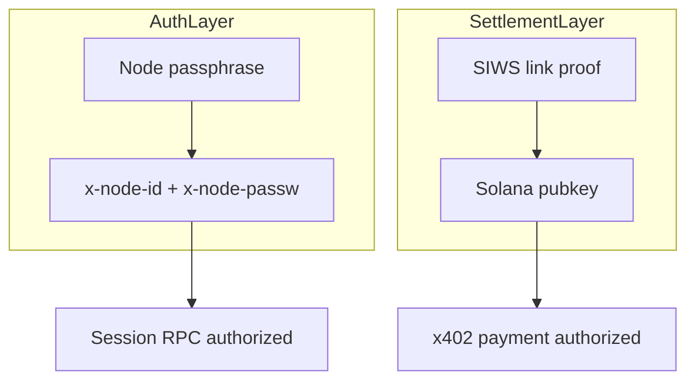

# Security and compliance

Threat model, controls, and review checklist for x402 + Solana payments in Agent Play.

**See also:** [Wallet linking](02-solana-wallet-linking.md) · [Settlement](04-settlement-and-idempotency.md) · [Node ID v1](../../notes/node-id-v1-migration.md)

---

## Threat model

| Threat | Impact | Mitigation |
|--------|--------|------------|
| Stolen main node passphrase | Auth as user; initiate payments if wallet linked | Passphrase hygiene; optional 2FA future; unlink wallet on compromise |
| Forged SIWS signature | Link attacker wallet to victim node | Ed25519 verify, nonce, domain binding |
| Nonce replay | Re-link or replay challenge | Single-use nonce, TTL ≤ 5m |
| Client tampering with `payTo` | Redirect seller funds | Server resolves payee; verify matches quote |
| Facilitator compromise | False verify | Facilitator trust boundary; monitor; multi-facilitator future |
| Idempotency bypass | Double commit | Redis CAS on idempotency key |
| Race on same item | Double sell | Existing WATCH/MULTI on item row |
| Insufficient verify-before-commit | Free items | Metric `commit_without_verify` = 0 alert |
| Hot wallet on server | Key theft | **No private keys on Agent Play server** in v1 |

---

## Identity layers

Passphrase proves **who you are to Agent Play**.  
SIWS proves **which Solana address you control** for settlement.

Both required for paid actions in x402 mode.

---

## SIWS controls

| Control | Requirement |
|---------|-------------|
| Nonce entropy | CSPRNG, ≥ 128 bits |
| Nonce storage | Redis `SET key NX EX 300` |
| Message domain | Must match `AGENT_PLAY_CANONICAL_DOMAIN` |
| Clock skew | Reject `expiresAt` in past |
| Signature | ed25519 over exact message bytes |
| Address format | Valid base58 pubkey, correct length |

Unlink:

- Re-sign with same wallet **or**
- Platform key + `AGENT_SERVICE_KEY` + audit log entry

---

## x402 / facilitator trust

Agent Play trusts facilitator **verify** response for:

- Amount ≥ quoted `amountMicro`
- Asset = USDC, network matches env
- Payee = server-resolved address
- Resource id matches intent

**Validate facilitator response schema**; reject unknown fields in strict mode.

### Facilitator selection

| Option | Trust implication |
|--------|-------------------|
| Hosted CDP | Trust Coinbase ops + contract |
| Self-hosted | You operate verify logic + settlement wallet |

Document choice in security review sign-off.

---

## Key custody

| Key material | Location |
|--------------|----------|
| User Solana private key | User wallet only |
| Main node passphrase | User client only (hashed on wire) |
| Platform treasury | Operator custody (receive only in v1) |
| Facilitator settlement key | Facilitator infra |
| `AGENT_SERVICE_KEY` | Server secret — not a payment key |

---

## Logging and PII

**Log**

- node id (truncated optional)
- solana address (truncated)
- resource id, sku, amountMicro
- tx signature, intent id, idempotency key
- verify/settle latency

**Do not log**

- Full SIWS message nonces in public logs (ok in secure audit)
- Passphrase material
- Raw `X-PAYMENT` payloads in production info logs (debug tier only)

---

## Rate limiting

| Endpoint | Limit (suggested) |
|----------|-------------------|
| `getSettlementChallenge` | 10 / min / node |
| `linkSettlementProfile` | 5 / min / node |
| `preparePayment` | 60 / min / node |
| `purchase` with verify | 30 / min / node |

---

## Compliance considerations

Agent Play software is infrastructure; **operators** are responsible for:

- Sanctions screening (facilitator may offer attestations)
- Tax reporting on on-chain receipts
- Terms of service for paid agent services
- Regional restrictions on crypto payments

v1 does not embed KYC. Document facilitator attestation hooks for future ([x402 spec extensions](https://github.com/coinbase/x402)).

---

## Security review checklist (pre-mainnet)

- [ ] SIWS implementation reviewed (nonce, domain, signature)
- [ ] Payee resolution unit tests for every SKU
- [ ] No private keys in repo or container images
- [ ] Facilitator TLS pin or allowlist configured
- [ ] Idempotency fuzz tested
- [ ] `commit_without_verify` alert wired
- [ ] Unlink + compromised wallet procedure documented
- [ ] Dependency audit on `@solana/web3.js` and x402 client libs
- [ ] Pen test on link + purchase flows (staging)

---

## Incident response

| Incident | Immediate action |
|----------|------------------|
| Facilitator key leak | Rotate facilitator creds; pause `x402` mode |
| Wrong payee in catalog bug | Stop quotes; reconcile txs; patch + refund policy |
| Mass `PAYMENT_INVALID` | Check mint/network env mismatch |
| User wallet drained (phishing) | Out of band — educate; verify domain in SIWS message |

---

## Related

- [API keys](../../api-keys.md)
- [User management v2](../../notes/user-management-system-v2.md)
- [Observability](10-observability.md)
