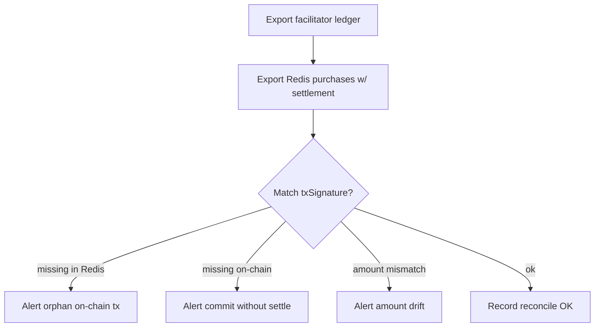

# Observability

Metrics, alerts, reconciliation, and payment tracing for x402 + Solana in production.

**See also:** [Settlement](04-settlement-and-idempotency.md) · [Platform ops](07-aql-and-platform-ops.md) · [Security](09-security-and-compliance.md)

---

## Trace correlation

Every priced request should carry:

| Field | Source |
|-------|--------|
| `paymentTraceId` | Generated at 402 issue; returned in response headers |
| `intentId` | Redis payment intent |
| `idempotencyKey` | Client + server |
| `resource` | x402 resource id |

**Header:** `X-Payment-Trace-Id: pt_...`

Log across: RPC handler → PaymentGate → facilitator HTTP → SessionStore commit.

---

## Metrics (recommended)

### Counters

| Metric | Labels | Meaning |
|--------|--------|---------|
| `agent_play_x402_402_issued_total` | sku | Payment quotes issued |
| `agent_play_x402_verify_total` | result=ok\|fail | Facilitator verify outcomes |
| `agent_play_x402_settle_total` | result=ok\|fail | Settlements |
| `agent_play_x402_commit_total` | sku | World commits after verify |
| `agent_play_wallet_link_total` | action=link\|unlink | SIWS links |
| `agent_play_purchase_errors_total` | code | By error code |

### Histograms

| Metric | Labels |
|--------|--------|
| `agent_play_x402_verify_duration_ms` | sku |
| `agent_play_x402_settle_duration_ms` | sku |
| `agent_play_x402_commit_duration_ms` | sku |
| `agent_play_solana_rpc_duration_ms` | method |

### Gauges

| Metric | Meaning |
|--------|---------|
| `agent_play_payment_intent_stuck` | Intents verified but not committed > 5m |
| `agent_play_payment_intent_settle_pending` | Committed but no tx > 10m |

---

## Alerts

| Alert | Condition | Severity |
|-------|-----------|----------|
| VerifyFailureSpike | verify fail rate > 5% / 5m | warning |
| FacilitatorDown | verify timeout > 50% / 5m | critical |
| CommitWithoutVerify | any commit without verified intent | critical |
| StuckIntents | stuck gauge > 0 for 15m | warning |
| SettlePendingBacklog | settle_pending > 10 | warning |
| WrongNetworkPurchases | `WRONG_NETWORK` spike | warning |

Pager duty runbook links → [07 — Platform ops](07-aql-and-platform-ops.md).

---

## Reconciliation job

Nightly (or hourly on mainnet):



### Orphan categories

| Category | Action |
|----------|--------|
| On-chain tx, no Redis purchase | Investigate client bug or external pay |
| Redis purchase, no tx | Retry settle or manual refund |
| Amount drift | Halt SKU quotes; patch quote builder |

Store reconcile reports at `agent-play:{hostId}:reconcile:{date}` (optional).

---

## Dashboards

### Payments overview

- 402 issued vs verify OK vs commit OK (funnel)
- Revenue by sku (amountMicro sum)
- p95 verify latency
- Error code breakdown

### Agent developer view (platform)

- Top payee addresses by volume
- Talk tick volume per agentId

### Health

- Facilitator uptime check
- Solana RPC error rate

---

## Structured log events

```json
{
  "event": "payment.verify.ok",
  "paymentTraceId": "pt_abc",
  "intentId": "int_xyz",
  "sku": "amenity.item",
  "resource": "agent-play://space/.../item/...",
  "amountMicro": "24990000",
  "payerNodeId": "node:...",
  "payeeAddress": "7xKX...",
  "facilitatorMs": 142
}
```

```json
{
  "event": "payment.commit.ok",
  "paymentTraceId": "pt_abc",
  "intentId": "int_xyz",
  "txSignature": "5abc...",
  "purchaseId": "rec-..."
}
```

---

## Stuck intent sweeper

Cron every 5 minutes:

1. Scan `payment-intent:*` where `status=verified` and `verifiedAt < now - 15m`
2. Retry `executePurchaseAfterSettlement` once
3. If still stuck → alert + set `failed` with reason
4. Never auto-mark item sold without successful EXEC

---

## Dev / staging

- Enable verbose payment logs with `AGENT_PLAY_VERBOSE=1`
- Facilitator mock server in CI — record metrics in test reports
- Devnet dashboard separate from mainnet (label all charts)

---

## Production checklist

- [ ] `paymentTraceId` in every 402 and 200 payment response
- [ ] Dashboards imported (Grafana/Datadog/etc.)
- [ ] Alerts routed to on-call
- [ ] Reconciliation job scheduled + failure alerts
- [ ] Stuck intent sweeper deployed
- [ ] Monthly reconcile sign-off process for finance

---

## Related

- [Master plan §11](../../x402-solana-payments-plan.md#11-production-checklist)
- [Redis world](../../redis-world.md)
- [K8s debugging runbook](../../notes/k8s-agent-play-debugging.md)
