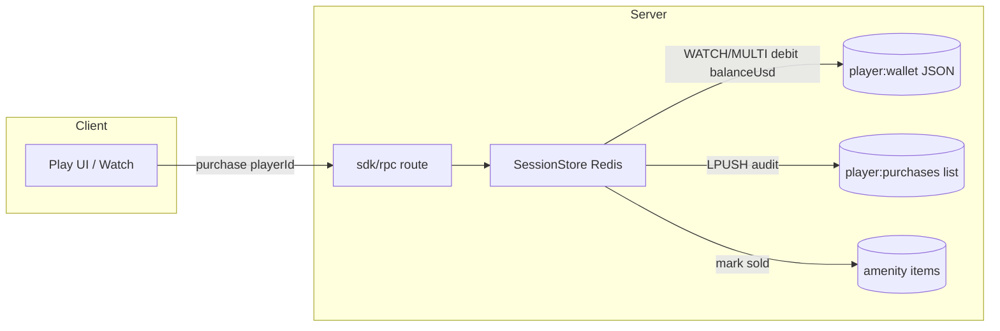
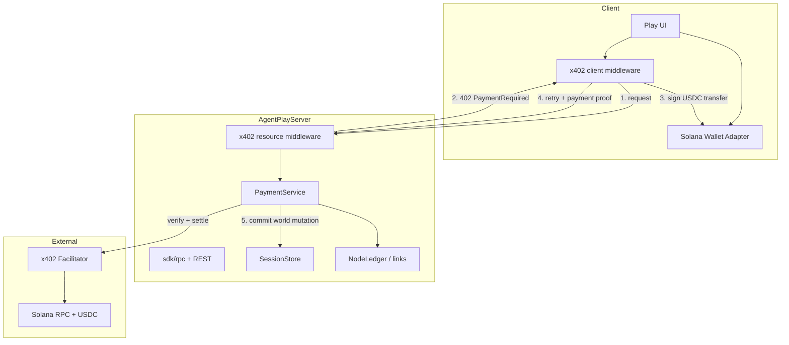
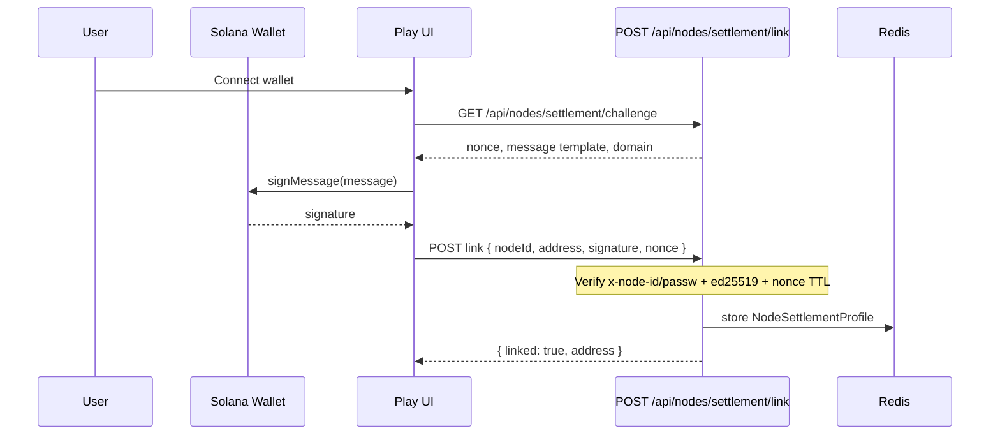
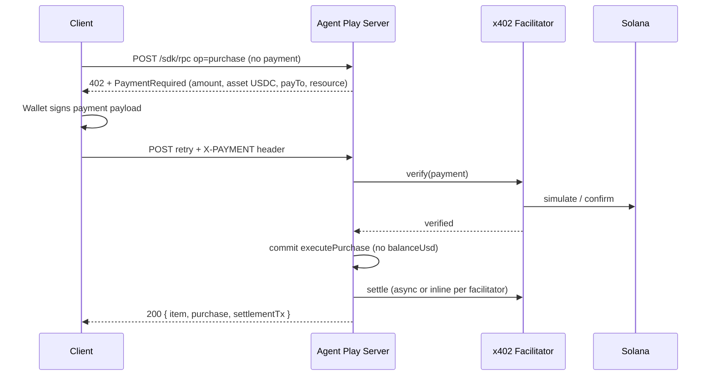
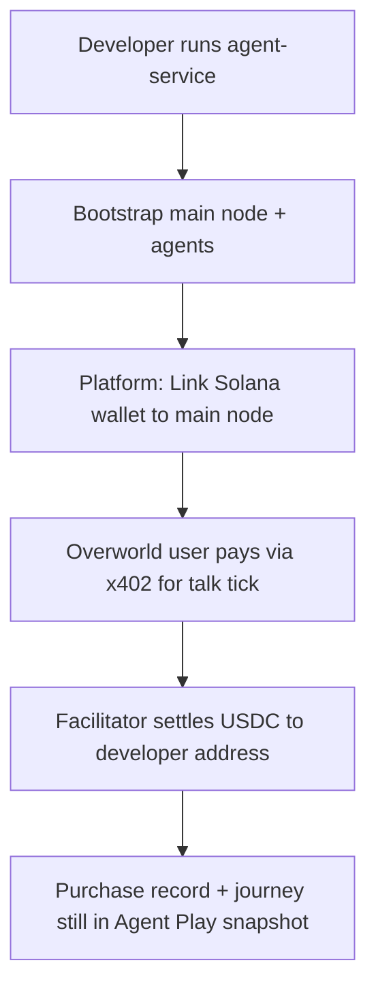
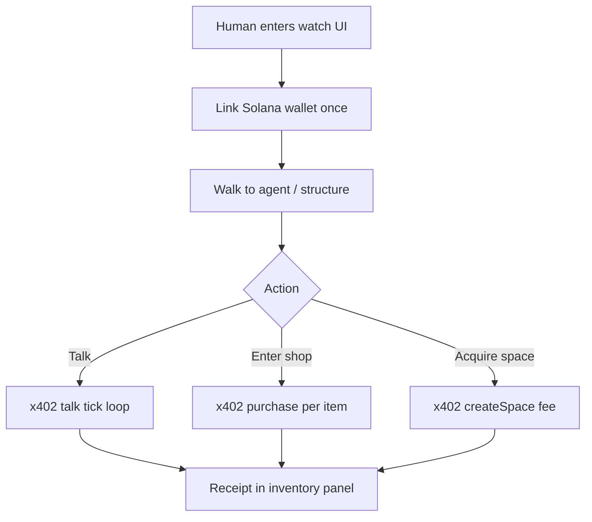
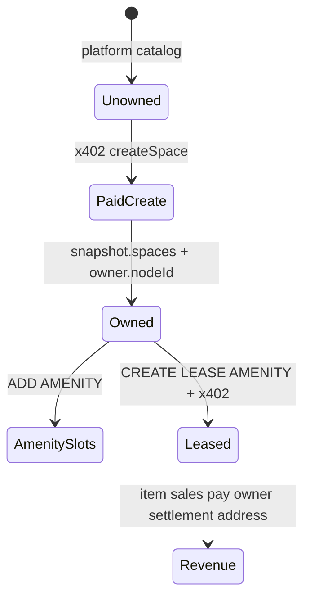
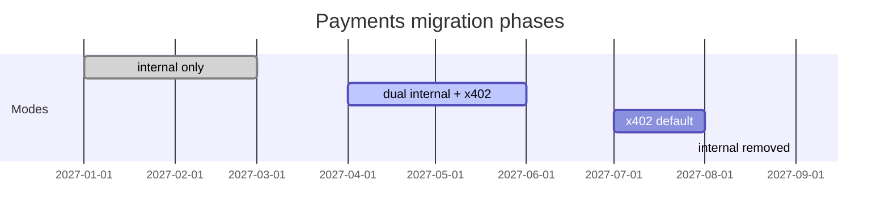

# x402 + Solana payments — documentation and implementation plan

This document is the **master plan** for replacing Agent Play’s internal Redis wallet with **production-grade x402 settlement on Solana**. It defines the documentation set to write, the target architecture, explainer diagrams, and the core code changes required across `@agent-play/sdk`, `@agent-play/web-ui`, and `@agent-play/play-ui`.

**Status:** planning / not shipped. Today’s system is documented in [Payments, wallets, and talk billing](payments-wallets-and-talk-billing.md) (lazy-seeded `$70`, atomic `purchase`, talk ticks).

---

## 1. Goals and non-goals

### Goals

| Goal | Description |
|------|-------------|
| **Replace internal wallet** | Remove `balanceUsd` / lazy `$70` seed as the source of truth for production payments. |
| **Solana settlement** | Payer signs; facilitator verifies and settles **USDC on Solana** (devnet → mainnet-beta). |
| **x402 at the HTTP boundary** | Paid RPCs and routes return **402 Payment Required** with machine-readable payment terms; clients retry with proof. |
| **Dual wallet roles** | **Agent developers** link a Solana address to their **main node** to receive service revenue. **Overworld users** link a wallet to pay for agents, spaces, leases, and amenity items. |
| **Preserve world semantics** | Purchases still flip `sale.status`, append audit rows, and fan out `space:amenity_content_updated` — settlement moves on-chain, state transitions stay server-authoritative. |
| **Production operability** | Idempotency, replay protection, observability, key rotation, and explicit devnet/mainnet configuration. |

### Non-goals (v1)

- Supporting every x402 network (EVM-only facilitators, etc.) — **Solana-first**.
- Browser extension–less card rails (see separate backlog: [Payments as amenities](pending-features.md)).
- On-chain space NFTs or amenity deeds — **off-chain catalog + on-chain payment** in v1.
- Replacing node passphrase auth — Solana wallet **augments** identity for settlement; `x-node-id` / `x-node-passw` remain for session RPC auth until a later phase.

---

## 2. Documentation set

**Shipped:** full series under [`docs/payments/x402-solana/`](payments/x402-solana/README.md).

| # | Document | Audience |
|---|----------|----------|
| — | [README](payments/x402-solana/README.md) | Hub + quick reference |
| 1 | [01-x402-overview](payments/x402-solana/01-x402-overview.md) | All developers |
| 2 | [02-solana-wallet-linking](payments/x402-solana/02-solana-wallet-linking.md) | Integrators, UI |
| 3 | [03-payment-catalog](payments/x402-solana/03-payment-catalog.md) | Product + backend |
| 4 | [04-settlement-and-idempotency](payments/x402-solana/04-settlement-and-idempotency.md) | Backend |
| 5 | [05-agent-developer-payouts](payments/x402-solana/05-agent-developer-payouts.md) | Agent-service hosts |
| 6 | [06-overworld-user-flows](payments/x402-solana/06-overworld-user-flows.md) | Play UI |
| 7 | [07-aql-and-platform-ops](payments/x402-solana/07-aql-and-platform-ops.md) | Ops |
| 8 | [08-migration-from-internal-wallet](payments/x402-solana/08-migration-from-internal-wallet.md) | Existing deployments |
| 9 | [09-security-and-compliance](payments/x402-solana/09-security-and-compliance.md) | Security review |
| 10 | [10-observability](payments/x402-solana/10-observability.md) | SRE |

Update [payments-wallets-and-talk-billing.md](payments-wallets-and-talk-billing.md) banner points to the x402 doc tree; internal wallet marked **legacy (dev only)** after cutover.

---

## 3. Current vs target architecture

### 3.1 Today (internal wallet)



**Identity:** wallet owner = **main node id** (passphrase-derived), not Solana address.

### 3.2 Target (x402 + Solana)



**Identity:** **main node id** (auth) + **linked Solana pubkey** (settlement). Payout addresses resolved via `NodeSettlementProfile`.

---

## 4. Identity model: node + Solana wallet

### 4.1 Settlement profile (new catalog entity)

Store per **node id** (main node for humans; main node of agent operator for agent revenue):

```typescript
type NodeSettlementProfile = {
  nodeId: string;                    // main node id
  solanaAddress: string;             // base58 pubkey
  chain: "solana:devnet" | "solana:mainnet-beta";
  linkedAt: string;                  // ISO
  linkProof: {
    message: string;                 // SIWS canonical message
    signature: string;               // ed25519
    nonce: string;
    expiresAt: string;
  };
  role: "payer" | "payee" | "both";  // UI capability flags
  status: "active" | "revoked";
};
```

**Redis key:** `agent-play:{hostId}:node:{nodeId}:settlement`

### 4.2 Linking flow (SIWS-style)



**Rules:**

- Only **main node** credentials may link a **payee** profile (agent developers receiving money).
- Any credentialed main node may link a **payer** profile (overworld users).
- Unlink requires fresh signature or platform key + cooldown (document in **doc C**).

### 4.3 Payee resolution for each payment type

| Payment type | Payee |
|--------------|-------|
| Agent talk / agent API service | Agent operator’s **main node** settlement address (via `agentId` → parent main node) |
| Amenity item purchase | **Space owner** `owner.nodeId` → settlement profile; fallback platform treasury if unset |
| Space acquisition fee | Platform treasury + optional referrer (future) |
| Amenity lease | Space owner or platform policy (doc D) |

Extend `SpaceOwner` snapshot field usage — today `owner.nodeId` exists but is not used for payouts.

---

## 5. x402 integration points

### 5.1 Where 402 applies

Wrap **priced** operations at the HTTP layer (`packages/web-ui/src/app/api/agent-play/sdk/rpc/route.ts` and selected REST routes):

| Operation | Current gate | x402 resource id (example) |
|-----------|--------------|----------------------------|
| `purchase` | Internal wallet debit | `agent-play://space/{spaceId}/amenity/{kind}/item/{id}` |
| `talkSessionStart` / `tick` / `stop` | Internal wallet debit | `agent-play://talk/{agentId}/tick` |
| `createSpace` (paid tier) | Platform key only today | `agent-play://space/create` |
| `createAmenityLease` | Space context | `agent-play://space/{spaceId}/lease/{kind}` |
| Future: agent RPC proxy | N/A | `agent-play://agent/{agentId}/invoke` |

**Unpaid reads** (`getWorldSnapshot`, `getPlayerWallet` → becomes `getSettlementProfile`, `inspectSpace`) stay **200** without x402.

### 5.2 Request / response contract (doc B detail)



Implement via a shared **`PaymentGate`** module used by RPC `switch` cases — not ad hoc per handler.

### 5.3 Facilitator configuration (production)

Environment (host-level):

| Variable | Purpose |
|----------|---------|
| `X402_FACILITATOR_URL` | Verify/settle HTTP base |
| `X402_FACILITATOR_AUTH` | Optional bearer for hosted facilitator |
| `SOLANA_RPC_URL` | Confirmation polling fallback |
| `AGENT_PLAY_TREASURY_SOLANA` | Platform receive address |
| `AGENT_PLAY_SETTLEMENT_NETWORK` | `solana:devnet` \| `solana:mainnet-beta` |
| `AGENT_PLAY_PAYMENTS_MODE` | `internal` \| `x402` \| `dual` (migration) |

**Doc H** must include facilitator SLAs, rate limits, and what happens when facilitator is down (fail closed vs queue intents).

---

## 6. User journeys (explainer diagrams)

### 6.1 Agent developer: receive talk / service revenue



**Doc F** covers: mapping `agentId` → operator main node, revenue share, testnet USDC faucet, reconciliation exports.

### 6.2 Overworld user: pay agent + buy in amenity



**Doc G** covers: Wallet Adapter UI, insufficient USDC UX, devnet banner, mobile wallet deep links.

### 6.3 Space acquisition + amenity ownership



**Pricing:** space creation fee (platform), lease deposit (escrow policy in doc D), item list prices remain `priceUsd` but denominated in USDC at settlement time (1:1 micro-USDC or oracle — **decision required in doc D**).

---

## 7. Core code changes (implementation matrix)

### 7.1 New packages / modules

| Location | Responsibility |
|----------|----------------|
| `packages/sdk/src/lib/x402-client.ts` | Browser-safe payment retry, resource id builders |
| `packages/sdk/src/lib/settlement-types.ts` | Zod schemas: `NodeSettlementProfile`, `SettlementReceipt`, extend `PurchaseRecord` |
| `packages/web-ui/src/server/agent-play/payment-gate.ts` | Build 402 body, verify proof, call facilitator |
| `packages/web-ui/src/server/agent-play/settlement-store.ts` | Redis CRUD for profiles, payment intents |
| `packages/web-ui/src/server/agent-play/solana-verify.ts` | SIWS signature verification ( `@solana/web3.js` ) |
| `packages/play-ui/src/solana-wallet-panel.ts` | Connect / balance / link status strip |
| `packages/play-ui/src/x402-purchase-client.ts` | Replace `executePurchase` internal path when `paymentsMode=x402` |

### 7.2 Modify existing surfaces

| File / area | Change |
|-------------|--------|
| `packages/sdk/src/lib/space-content-model.ts` | Deprecate `PlayerWalletSchema` for production; add `SettlementReceiptSchema`, `purchase.settlementTxSignature` |
| `packages/web-ui/src/server/agent-play/redis-session-store.ts` | `executePurchase`: branch on `paymentsMode`; x402 path skips `balanceUsd` debit, requires pre-verified intent id |
| `packages/web-ui/src/app/api/agent-play/sdk/rpc/route.ts` | Integrate `PaymentGate` on priced ops; new ops: `linkSettlement`, `getSettlementProfile`, `preparePayment` |
| `packages/web-ui/src/app/api/agent-play/players/[id]/wallet/route.ts` | Redirect to settlement profile or return `{ mode: "x402", usdcBalance? }` via RPC read (optional) |
| `packages/play-ui/src/wallet-hud.ts` | Show USDC + link state instead of `$70` pill when x402 enabled |
| `packages/play-ui/src/purchase-client.ts` | x402 retry loop |
| `packages/play-ui/src/preview-session-interaction-panel.ts` | Talk billing via x402 ticks |
| `docs/payments-wallets-and-talk-billing.md` | Legacy section |
| AQL | Deprecate `SET WALLET`; optional `LINK SETTLEMENT` for ops scripts (doc H) |

### 7.3 Purchase record evolution

Extend `PurchaseRecordSchema`:

```typescript
// Add optional block — required when paymentsMode=x402
settlement: {
  network: "solana:devnet" | "solana:mainnet-beta";
  asset: "USDC";
  amountMicro: string;           // integer string
  payerAddress: string;
  payeeAddress: string;
  txSignature: string;
  x402Resource: string;
  facilitatorRef?: string;
  idempotencyKey: string;
}
```

Keep `priceUsd` for display/backward compat during `dual` mode.

### 7.4 Idempotency and atomic commit

```mermaid
flowchart LR
  subgraph Redis
    INT[payment:intent:{id}]
    ITEM[amenity item hash]
    PUR[purchases list]
  end
  V[Facilitator verify OK] --> INT
  INT -->|WATCH/MULTI| ITEM
  INT --> PUR
  INT -->|DEL or status=committed| INT
```

**Rule:** never mark item sold until verify succeeds; never verify twice for same `idempotencyKey` (store `committed` with tx signature).

---

## 8. Payment catalog (starter — doc D expands)

| SKU | Resource template | Default payee | Trigger |
|-----|-------------------|---------------|---------|
| `amenity.item` | space + kind + item id | space owner | `purchase` |
| `talk.second` | agent + viewer pair | agent operator main node | `talkSessionTick` |
| `space.create` | new space id (preallocated) | platform treasury | `createSpace` |
| `amenity.lease` | space + kind + term | space owner / escrow | `createAmenityLease` |

**Devnet:** use USDC mint from Circle/SPL faucet; document mint address per environment in doc D.

---

## 9. UI / UX changes

| Surface | Change |
|---------|--------|
| Watch UI header | Replace wallet pill with **Solana link status** + USDC (read-only or wallet-reported) |
| Item tooltip | **Buy** triggers wallet sign → x402 retry; errors: `INSUFFICIENT_USDC`, `WALLET_NOT_LINKED`, `SETTLEMENT_PENDING` |
| Platform page | **Settlement** tab: link wallet, view payout address, export CSV |
| Playground | Banner when `paymentsMode=x402`; remove `$70` assumptions in seed docs |
| Agent-service README | Step: link Solana wallet after main node bootstrap |

---

## 10. Migration strategy (doc I)



| Phase | `AGENT_PLAY_PAYMENTS_MODE` | Behavior |
|-------|----------------------------|----------|
| 0 | `internal` | Current production |
| 1 | `dual` | x402 required for new priced ops; internal wallet hidden in UI; `SET WALLET` ops-only |
| 2 | `x402` | No lazy seed; all priced RPCs 402 without proof |
| 3 | `x402` + delete | Remove `PlayerWalletSchema` paths, PU bundles, talk internal debit |

**Data migration:** no automatic conversion of `balanceUsd` to USDC — document manual credits or one-time airdrop script for demo hosts.

---

## 11. Production checklist

### Security (doc J)

- [ ] SIWS nonce single-use, TTL ≤ 5 minutes, domain-bound
- [ ] Settlement link changes require re-sign or platform key + email cooldown
- [ ] Facilitator responses validated (signature, amount, payee, resource match)
- [ ] Idempotency keys scoped to `{nodeId, resource, window}`
- [ ] No private keys on Agent Play server (facilitator or user wallet only)
- [ ] Rate limits on `preparePayment` and link endpoints

### Reliability (doc E, K)

- [ ] Payment intent stuck-job sweeper (verify OK but commit failed)
- [ ] Reconciliation: compare facilitator ledger vs Redis purchases nightly
- [ ] Metrics: `x402_402_issued`, `x402_verify_fail`, `settlement_commit_latency`, `solana_rpc_errors`
- [ ] Alert on commit-without-verify (must be zero)

### Testing

- [ ] Devnet E2E: link → purchase item → sold state + tx on explorer
- [ ] Devnet E2E: talk tick → agent operator receives USDC
- [ ] Race: double `purchase` same item → one succeeds, one `ITEM_ALREADY_SOLD`
- [ ] Facilitator down → 503 with retry-after, no partial sold state
- [ ] Contract tests for extended `PurchaseRecordSchema`

---

## 12. Open decisions (resolve in doc D before build)

1. **USDC ↔ `priceUsd` mapping:** strict 1 USD = 1 USDC micro-unit, or FX buffer?
2. **Lease escrow:** on-chain program vs facilitator-held vs honor-system v1?
3. **Agent without linked wallet:** block service start vs accumulate platform-held balance?
4. **Facilitator:** self-hosted vs CDP/hosted — affects auth and SLA.
5. **Mobile watch UI:** Wallet Adapter vs deep link to Phantom/Solflare only?

---

## 13. Suggested implementation order

1. **Schemas + settlement store** — profiles, intents, extended purchase records  
2. **SIWS link API + platform UI** — no payments yet  
3. **PaymentGate + facilitator verify** — single SKU: amenity item purchase on devnet  
4. **Play UI x402 purchase path** — replace tooltip buy flow  
5. **Talk billing x402** — agent payout routing  
6. **Paid `createSpace` + lease** — space economy  
7. **Dual mode + migration docs** — deprecate internal wallet  
8. **Mainnet + security review** — doc J sign-off  

---

## 14. Related docs

- [Payments, wallets, and talk billing](payments-wallets-and-talk-billing.md) — current internal system  
- [Architecture](architecture.md) — spaces, ownership, snapshots  
- [Structures and spaces world model](notes/structures-and-spaces-world-model.md) — `owner`, leases  
- [Pending features](pending-features.md) — card payments, crypto wallet backlog items  
- [Occupant model v1](occupant-model-v1.md) — human → agent interaction policy  
- [x402 specification (external)](https://github.com/coinbase/x402/blob/main/specs/x402-specification-v2.md)

---

## Appendix A — RPC additions (draft)

| Op | Auth | Purpose |
|----|------|---------|
| `getSettlementChallenge` | main node headers | Issue SIWS nonce |
| `linkSettlementProfile` | main node headers + signature | Bind Solana address |
| `unlinkSettlementProfile` | main node headers + signature or platform key |
| `getSettlementProfile` | sid + node id | Read link status (no secret) |
| `preparePayment` | sid + node id | Returns resource id + quote for client sign |
| `purchase` | existing + **X-PAYMENT** when x402 | Commit after verify |

---

## Appendix B — Environment example

```bash
# Facilitator + Solana
X402_FACILITATOR_URL=https://facilitator.example.com
AGENT_PLAY_SETTLEMENT_NETWORK=solana:devnet
SOLANA_RPC_URL=https://api.devnet.solana.com
AGENT_PLAY_TREASURY_SOLANA=<platform-base58-address>
AGENT_PLAY_USDC_MINT=<spl-usdc-mint-devnet>

# Mode
AGENT_PLAY_PAYMENTS_MODE=dual

# Existing
AGENT_SERVICE_KEY=<platform-ops-key>
```

---

*Last updated: documentation series complete under `docs/payments/x402-solana/`. This file remains the architecture anchor; child docs are the implementation source of truth.*
